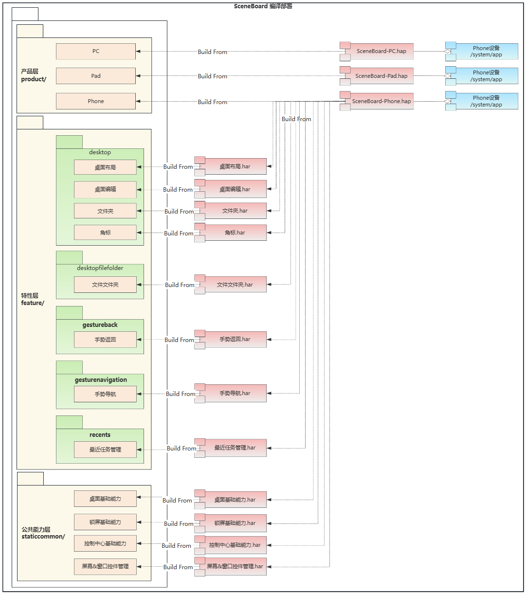

# SceneBoard

## 简介
**SceneBoard** 是 OpenHarmony 窗口子系统的部件之一。作为系统级应用，承载系统与用户交互的入口、以及系统UI的实现（例如：系统桌面、壁纸、锁屏等），支持 Phone、Pad、PC 等多种设备形态，提供全场景桌面体验。还承载了管理系统所有屏幕和窗口的能力。


### 核心能力
**系统交互入口**
- 使用 `ServiceExtensionAbility` 作为 SceneBoard 应用的主入口，SceneBoard会在系统启动时启动。
- 负责初始化和编排合一桌面 UI 的显示和层级关系，为用户提供桌面交互体验。
- 负责初始化屏幕和窗口控件管理模块，实现加载屏幕控件和窗口控件。

> SceneBoard的定位是一个系统服务层的部件，需要以系统服务的形式常驻运行，因此需要以 ServiceExtensionAbility 作为主入口，而不是 UIAbility 。

**合一桌面**：使用系统窗口加载合一桌面 UI 界面，例如：壁纸、桌面、状态栏、锁屏、通知、Dock 等。

**屏幕和窗口控件管理**
- 通过窗口控件，管理应用主窗口、辅助窗口、系统窗口及其容器关系，管理窗口层级、焦点，以及布局、拖拽、旋转、动画等。
- 通过屏幕控件，管理主屏、扩展屏、虚拟屏等屏幕实例及其生命周期，感知屏幕尺寸、旋转等属性变化，并同步管理屏幕中的窗口。

> 屏幕控件和窗口控件：
> 1. 窗口子系统基于 ArkUI 实现了屏幕控件和窗口控件，以达到复用UI 框架的布局、动画等 UI 能力。
> 2. 基于控件方式的屏幕和窗口管理，在 MVVM 架构模式下解耦 View\ViewModel\Model 的三者，以达到在不同产品上最大程度的复用基础的数据模型和业务管理框架。

**公共基础能力**
- 提供公共基础能力，例如：日志、Dump、内存、性能等工具。
- 提供特性间可复用的基础能力，例如：全局已安装应用的包信息管理、系统事件管理、设备事件和状态管理等。

### SceneBoard 与 window_manager 的关系
SceneBoard 和 window_manager 都是窗口子系统的部件，SceneBoard 依赖 window_manager。参考：[window_manager](https://gitcode.com/openharmony/window_window_manager)

**进程维度上** ：
1. SceneBoard 与 window_manager 中的窗口管理运行在同一个服务进程中，即 SceneBoard 的主入口 `ServiceExtensionAbility` 运行的进程。
2. SceneBoard 在系统启动时启动并常驻，启动后会先初始化窗口管理，再初始化屏幕和窗口控件、加载合一桌面UI。

**职责和调用关系上**：
1. SceneBoard 负责窗口和屏幕的显示、布局和层级等交互业务。window_manager 负责窗口和屏幕的实例以及生命周期等数据业务。
2. window_manager 负责与应用进程、以及与其他子系统（元能力子系统、图形渲染、多模输入等）的交互。
3. SceneBoard 不直接与应用进程、以及其他子系统交互，需要借助 window_manager 提供内部接口实现间接交互。
  
> 例如，应用窗口的创建过程：
> - 由应用进程通过窗口子系统提供的 API，先与 window_manager 交互；
> - window_manager 响应接口调用，完成窗口实例的创建和生命周期状态管理；
> - 再由 window_manager 通过内部接口通知 SceneBoard，由 SceneBoard 完成窗口控件的创建、显示和布局工作。

> **说明**：SceneBoard 仅在窗口子系统开启合一架构下生效。关于合一架构和配置方式，请参考说明：[合一架构](https://gitcode.com/openharmony/window_window_manager#3-%E5%88%86%E7%A6%BB%E6%9E%B6%E6%9E%84%E4%B8%8E%E5%90%88%E4%B8%80%E6%9E%B6%E6%9E%84%E8%AF%A6%E8%A7%A3)

## 架构说明

SceneBoard 采用分层和模块化的架构设计，如图：


### 分层设计
SceneBoard 整体采用分层和模块化架构设计，分为三层：
```
产品层 (product/)：产品适配相关
  ↓
特性层 (feature/)：模块化业务功能相关
  ↓
公共能力层 (staticcommon/)：基础管理框架、通用工具相关
```

**基本原则**：层与层之间按照模块功能的可复用程度进行划分，每一层按照模块间的业务边界划分。

**职责**
1. 公共能力层：
    - 承载：SceneBoard 运行所需的基础能力集。
    - 注意：`staticcommon/basecommon/windowscene` 是屏幕和窗口控件管理的基础框架，是 SceneBoard 必选的最基础模块。
    - 特性层各个模块包含的公共业务，也可以下沉到公共能力层。例如：DFX 工具（日志、Dump、内存等工具）、锁屏状态管理等需要跨多个特性复用的模块，放置在公共能力层；

2. 特性层：
    - 承载：抽象的公共特性的集合，每个特性高内聚、低耦合，且支持产品层进行定制。
    - 基于系统窗口的合一桌面 UI（系统桌面、锁屏、壁纸等）按照业务边界拆分成不同的模块，放置在特性层；

3. 产品层：
    - 承载：针对当前设备的个性化业务、以及对所需特性层和公共能力层的定制。
    - 公共能力和不同特性又由产品层的主入口进行集成和定制，打包为可直接部署的HAP包。

**关系**
1. 公共能力层和特性层，均无法直接部署和运行，需要由产品层集成后编译出HAP包，才能运行。
2. 产品层可以向下依赖特性层和公共能力层，特性层可以向下依赖公共能力层，依赖方向自上而下，不允许反向依赖。

### 模块化设计
SceneBoard 每一层都使用模块化设计，自下而上分别是：

1. 公共能力层：位于 `staticcommon` 目录，主要包含不同产品打包 SceneBoard 时，必须集成的基础能力。

| 公共能力层模块    | 路径                                        | 说明 |
| ---------- | ----------------------------------------- | --- |
| 屏幕与窗口控件管理  | staticcommon/basecommon/windowscene       | 提供统一屏幕和窗口的实例和数据模型管理能力，支撑上层管理屏幕和窗口的显示 |
| 基础工具       | staticcommon/basecommon/basicutils        | 提供常用的基础工具，例如日志、通用常量、工具方法等 |
| 桌面管理基础能力 | staticcommon/launchercommon               | 提供基础的桌面设置和编辑、应用安装、全局搜索等基础桌面业务管理框架 |
| 控制中心基础能力 | staticcommon/controlcentercommon          | 提供控制中心UI组件和业务管理等基础能力 |
| 锁屏基础能力   | staticcommon/screenlockcommon             | 提供锁屏状态和数据管理等基础能力 |
| 系统UI管理基础能力 | staticcommon/systemuicommon               | 提供通知、实况窗、弹窗、状态栏的UI组件和业务管理等基础能力 |
| 控件动画基础能力       | staticcommon/basecommon/componentanimator | 提供用于桌面UI元素动画控制的框架能力 |
| 控件拖拽基础能力       | staticcommon/basecommon/componentdrag     | 提供用于桌面UI元素拖拽控制的框架能力 |

2. 特性层：位于 `feature` 目录，主要包含可跨产品复用的特性能力，不同产品打包 SceneBoard 时可选集成不同特性。
    - 合一桌面相关的特性能力有：桌面（desktop）、应用中心（apPCenter）、锁屏（screenlock）等。
    - 窗口和屏幕控件管理能力：自由窗口（PCmode）、虚拟屏（commonscbscreen）等。

| 特性层模块  | 路径                             | 说明 |
| ------ | ------------------------------ | --- |
| 桌面   | feature/desktop                | 桌面布局、编辑、文件夹、角标等 |
| 壁纸   | feature/wallpapercomponent     | 壁纸管理 |
| 状态栏    | feature/statusbarcomponent     | 状态栏布局、UI等 |
| 锁屏     | feature/screenlock             | 锁屏布局、编辑、UI等 |
| 任务栏    | feature/smartdock              | DOCK 布局、图标显示等 |
| 应用中心   | feature/apPCenter              | 应用中心布局、编辑、拖拽等 |
| 应用安装管理 | feature/appinstall             | 应用安装管理、UI等 |
| 通用虚拟屏  | feature/commonscbscreen        | 基于屏幕和窗口控件管理公共能力，构建的各产品通用的异源虚拟屏能力，支持应用窗口的显示等 |
| 控制中心   | feature/controlcentercomponent | 控制中心布局、编辑、拖拽等 |
| 桌面文件夹  | feature/desktopfilefolder      | 文件夹显示、布局、拖拽等 |
| 返回手势   | feature/gestureback            | 全局返回手势管理 |
| 导航手势   | feature/gesturenavigation      | 底部导航手势管理 |
| 实况窗    | feature/liveview               | 系统实况窗 |
| 通知     | feature/notification          | 全局系统通知管理 |
| 自由多窗   | feature/PCmode                 | PC产品上常见的自由窗口样式特性模块 |
| 多任务    | feature/recents                | 系统多任务界面和多任务卡片管理 |
| 关机     | feature/shutdownview           | 全局系统关机界面 |
| 系统弹窗   | feature/systemdialog           | 全局系统弹窗 |
| 主题服务   | feature/themeservice                 | 全局主题服务 |
| 音量管理   | feature/volume                | 全局音量管理 |

3. 产品层：位于 `product` 目录，主要包含面向不同设备的 UI，以及特有交互的适配、产品资源文件等。

| 产品层模块  | 路径                             | 说明 |
| ------ | ------------------------------ | --- |
| Phone   | product/Phone                | Phone SceneBoard主入口和产品主界面、UI定义、Phone产品资源文件 |
| Pad   | product/Pad                | Pad SceneBoard主入口和产品主界面、UI定义、Pad产品资源文件 |
| PC   | product/PC                | PC SceneBoard主入口和产品主界面、UI定义、PC产品资源文件 |

## 编译构建


三层架构的各模块在编译态时，分别：
1. 公共能力层：
    - 各模块按照业务边界和功能内聚的原则进行划分，分别编译为HAR包。
    - 原则上，该层的模块是必选模块。

2. 特性层：
    - 各模块按照业务边界和功能内聚的原则进行划分，分别编译为HAR包。
    - 原则上，该层的模块是可选模块。

3. 产品层：
    - 该层按照不同产品进行划分，分别编译为可部署的HAP包。

### 模块间依赖

各个模块的 `oh-package.json5` 可配置当前模块的依赖模块。例如：Phone产品的 `product/Phone/oh-package.json5` 中：

```json
{
  "name": "sceneboard",
  "description": "",
  "version": "1.0.0",
  "dependencies": {
    // ... 公共能力层的模块集成
    "@ohos/windowscene": "../basecommon/windowscene", // 集成窗口管理基础能力组件

    // ... 特性层的模块集成
    "@ohos/volumepanelcomponent": "../../feature/volume/volumepanelcomponent", // 集成音量条组件
    "@ohos/controlcentercomponent": "../../feature/controlcentercomponent", // 集成控制控制中心组件
    "@ohos/screenlockcomponent": "../../feature/screenlockcomponent", // 集成锁屏组件
    
    //...
  }
}
```

**产品对特性的差异化集成**

产品层可通过集成不同的模块来实现不同 UI 界面和交互方式，例如：
- Phone 产品与 PC 产品按照各自产品的定义，可分别集成了不同的模块；
- Phone 产品集成了全局的导航手势模块，提供触摸屏手势的交互体验，而 PC 产品不需要该模块。
- PC 产品集成了自由窗口、任务栏模块，提供不同于Phone设备上的全屏窗口体验，以及桌面任务栏的交互体验，而 Phone 产品不需要集成该模块。
- 此外，如：壁纸、实况窗、通用虚拟屏等，Phone 和 PC 产品都进行了集成，提供跨平台一致的体验。

| 产品 | 集成模块举例 | 说明 |
| ----- | -------------------------------------------------------------------------------------------------------------------------------------------------------------------------------- | ---------------------------------------------- |
| Phone | // ...<br>@ohos/recents<br>@ohos/appcenter<br>@ohos/wallpapercomponent<br>@ohos/themeservice<br>@ohos/liveview<br>@ohos/gesturenavigation<br>@ohos/commonscbscreen<br>// ...<br> | 导航手势（仅Phone需要）<br> 主题服务（仅Phone需要）<br> 壁纸（通用）<br> 应用中心（通用）<br> 多任务（通用）<br> 实况窗（通用）<br> 通用虚拟屏（通用） |
| PC    | //...<br>@ohos/pcmode<br>@ohos/pcbase<br>@ohos/smartdock<br>@ohos/appcenter<br>@ohos/wallpapercomponent<br>@ohos/liveview<br>@ohos/commonscbscreen<br>// ...                     | 自由多窗（仅PC需要） <br>  任务栏（仅PC需要） <br>  应用中心（通用） <br>  壁纸（通用） <br>  实况窗（通用） <br> 通用虚拟屏（通用）         |

### 编译命令
SceneBoard 是系统部件，可使用下列两种方式进行编译：
1. 仅编译 `SceneBoard`
```bash
./build.sh --product-name {product_name} --build-target SceneBoard --ccache
```

2. 编译全部系统组件
```bash
./build.sh --product-name {product_name} --ccache
```

## SceneBoard 开发

SceneBoard 采用 ArkTS 语言开发，其中屏幕和窗口均通过控件的方式进行管理，也支持使用其他 ArkUI 能力，可开发参考：[ArkUI 开发概述](https://gitcode.com/openharmony/docs/blob/master/zh-cn/application-dev/ui/arkts-ui-development-overview.md)

### 基于已有模块的开发
适用场景：对已有的模块提供的功能进行功能定制，例如：对已有模块进行新集成或裁剪、对已有的UI进行修改。

**对已有模块的集成或者裁剪**
1. 参考上文模块间依赖的配置方式，对模块的依赖进行修改，按需新增或删除。
2. 新集成时：
    - 各模块的接口导出文件的声明位于 `{模块路径}\oh-package.json5` 中的。例如：`staticcommon/basecommon/basicutils` 模块。
    ```json
    {
      "name": "@ohos/basicutils",
      "version": "1.0.0",
      "description": "Please describe the basic information.",
      "main": "./src/main/ets/TsIndex.ts", // 接口声明文件
      "author": "",
      "license": "Apache-2.0",
      "dependencies": {}
    }
    ```
    - 集成模块后，需要按照被集成模块声明的接口文件中提供接口进行功能开发。
3. 裁剪时：
    - 在裁剪模块时，需要先移除模块依赖，再清理对被集成模块声明的接口的全部调用。

**对已有的UI进行修改**

以定制屏幕上的 UI 举例说明：
- 每个产品目录中，需要指定主入口`ServiceExtensionAbility`以及主界面`EntryView`，然后主界面需要定义自己的主屏幕。
- 主屏幕使用`Screen`屏幕控件实现，是用于承载产品合一桌面的顶层控件，通过在不同层级上组合合一桌面 UI 组件即可实现该产品的桌面交互体验。
- 例如，Phone 产品目中封装的 [SCBScreen](https://gitcode.com/openharmony-sig/window_scene_board/blob/master/product/phonebase/src/main/ets/SceneBoard/scenemanager/SCBScreen.ets) 组件，就在不同层级上分别集成了：
	- 壁纸(Wallpaper)、系统桌面(Desktop)、锁屏(ScreenLock)、状态栏(StatusBar)、输入法面板(KeyBoard)等合一桌面特性
	- 以及各类ScenePanel(分别承载应用主窗口、全局悬浮窗、画中画、悬浮球等)。
- 开发过程中，可以在特定层级中引入已有的模块的UI、或者自定义UI。

```typescript
// Phone产品的SCBScreen
@Component
export struct SCBScreen {

  build() {
    // ...

    // **CustomUI**， 自定义UI
    CustomUI(...)

    // 引入已有的模块的UI：应用窗口容器
    SCBScenePanel(...)
    // 引入已有模块的UI，画中画窗口容器
    SCBPictureInPictureScenePanel(...)

    // ...
  }
}
```

### 新产品或特性的开发
适用场景：需要新增自定义产品形态，集成差异化能力。

**步骤1：新增产品HAP包及依赖**
1. 在 `product` 目录中新增产品HAP包，例如：`product/pc`

2. 修改 `oh-package.json5`，按需集成不同的特性模块和公共能力模块。
    - `@ohos/windowscene` 是SceneBoard必选的核心模块，必选。

3. 修改 `module.json5`，配置HAP包的入口、权限声明等，例如：`product/pc/src/main/module.json5`

```json
{
  "module": {
    "name": "pc_sceneboard",   // 编译HAP的名称  
    "type": "entry",
    "srcEntry": "./ets/Application/AbilityStage.ets",
    "description": "$string:mainability_description",
    "mainElement": "com.ohos.sceneboard.MainAbility",
    "deviceTypes": [
      "2in1"             // 支持的设备形态，例如：default\tablet\2in1等，支持同时配置多个平台。
    ],
    "definePermissions": [] // 权限声明，按需，可选
  }
}
```

**步骤2：新增主入口**
1. 在HAP包中，MainAbility 需要继承自 `ServiceExtensionAblity` ，并且需要初始化 `@ohos/windowscene` 模块、加载主界面 `EntryView`。
    - 例如：PC产品 `product\pc\src\main\ets\MainAbility\MainAbility.ets` 及其主界面 `product\pc\src\main\ets\pages\EntryView.ets`。

```typescript
// MainAbility
export default class MainAbility extends ServiceExtensionAbility {
  onCreate(want: Want): void {
    // ...

    // 必选：使用@ohos/windowscene模块接口，初始化窗口管理服务。
    SCBSceneSessionManager.getInstance().init();
    // 必选：使用@ohos/windowscene模块接口，加载主界面。
    SCBSceneSessionManager.getInstance().loadContent('page/EntryView');

    // ...
  }
  //...
}
```

2. 在主界面中通过 `RootScene` 挂载 `SCBScreen` 或定制的特定屏幕。
    - `RootScene` 为 SceneBoard 全局根节点，必须位于主界面的根节点。

```typescript
@Component
struct EntryView {
  // 必选：使用@ohos/windowscene模块接口获取SCBRootSceneSession。
  private rootSceneSession: SCBRootSceneSession = SCBSceneSessionManager.getInstance().getRootSceneSession();

  build() {
    RootScene(this.rootSceneSession.session) { // 全局根节点
      ForEach(this.screenSessionList, (item: SCBScreenSession) => {
        if (item.session.innerName === CUSTOM_SCB_SCREEN) {
          // 虚拟屏
        } else if (this.isExtendScreen(item)) {
          // 扩展屏
        } else if { xxx } {
	      // CustomXXXScreen
	      CustomScreen()
        } else {
          // 主屏
          SCBScreen({ screenSession: item })
        }
      }, (item: SCBScreenSession) => item.session.screenId.toString())
    }
  }
}
```

3. 配置Ability作为启动入口。例如：`product\phone\src\main\module.json5`

```json
{
  "module": {
    "name": "phone_sceneboard", // 编译HAP的名称  
	// ...
    "extensionAbilities": [
	  {
        "skills": [
          {
            "entities": [
              "entity.system.home",
              "flag.home.intent.from.system"
            ],
            "actions": [
              "action.system.home",
              "com.ohos.action.main",
              "action.form.publish"
            ]
          }
        ],
        "visible": true,
        "name": "com.ohos.sceneboard.MainAbility",
        "icon": "$media:icon",
        "description": "$string:mainability_description",
        "label": "$string:entry_MainAbility",
        "srcEntry": "./ets/MainAbility/MainAbility.ets",  // 声明入口MainAbility路径
        "type": "service"                                 // 声明ServiceExtensionAbility
      },
    ]
   // ...
}
```

**步骤3：定制UI**
在完成步骤1和2之后，准备工作就已经完成，定制UI可参考上一节。

## 目录
```text
scene_board
├─AppScope                           # 资源、多语言与应用级配置
├─feature                            # 特性层
│  ├─appcenter                       # 应用中心
│  ├─appinstall                      # 应用安装界面
│  ├─commonscbscreen                 # 通用屏幕与窗口面板模板
│  ├─desktop                         # 系统桌面
│  ├─gestureback                     # 返回手势
│  ├─liveview                        # 实况窗
│  ├─notification                    # 通知
│  ├─pcmode                          # PC 模式、自由窗与分屏能力
│  ├─recents                         # 多任务、任务中心
│  ├─screenlock                      # 锁屏
│  ├─smartdock                       # 任务栏
│  ├─systemdialog                    # 系统弹窗
│  ├─themecomponent                  # 主题
│  └─volume                          # 音量控制 
├─product                            # 产品层
│  ├─pad                             # 平板产品模块
│  ├─pc                              # PC 产品模块
│  ├─pcbase                          # PC 产品基础能力
│  ├─phone                           # 手机产品模块
│  └─phonebase                       # 手机/平板产品基础能力
├─scripts                            # 构建与辅助脚本
├─staticcommon                       # 公共能力层
│  ├─basecommon/basicutils           # 基础设施、工具
│  ├─basecommon/windowscene          # 窗口和屏幕控件公共能力
│  ├─controlcentercommon             # 控制中心公共能力
│  ├─launchercommon                  # 系统桌面公共能力
│  ├─screenlockcommon                # 锁屏公共能力
│  └─systemuicommon                  # 系统UI公共能力
└─hvigor                             # 工程构建脚本
```

## 约束
- 语言版本：ArkTS
- 编译依赖：
    - `window_use_scene_board` 特性开关需为 `true`，即使能窗口合一架构。参考：[window_manager架构切换](https://gitcode.com/openharmony/window_window_manager#23-%E5%8F%8C%E6%9E%B6%E6%9E%84)

## 参与贡献<a name="section171384529153"></a>

欢迎广大开发者贡献代码、文档等，具体的贡献流程和方式请参见[参与贡献](https://gitcode.com/openharmony/docs/blob/master/zh-cn/contribute/%E5%8F%82%E4%B8%8E%E8%B4%A1%E7%8C%AE.md)。

## 相关仓
- [window_manager](https://gitcode.com/openharmony/window_window_manager)
- [arkui_ace_engine](https://gitcode.com/openharmony/arkui_ace_engine)
