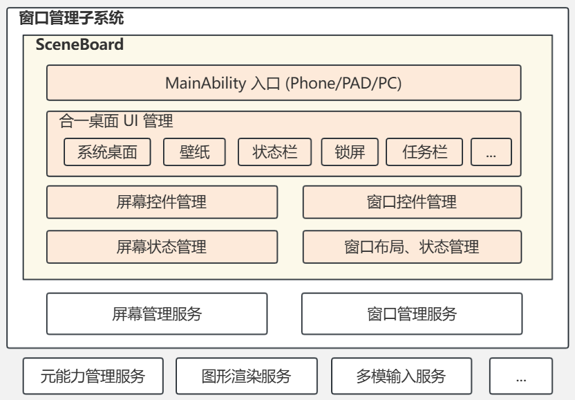
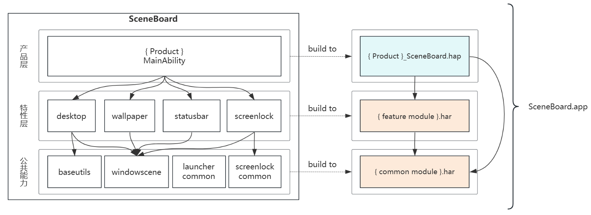

# SceneBoard

- [SceneBoard](#SceneBoard)
  - [简介](#简介)
  - [架构说明](#架构说明)
  - [开发步骤](#开发步骤)
  - [目录](#目录)
  - [编译](#编译)
  - [约束](#约束)
  - [相关仓](#相关仓)

## 简介
**SceneBoard** 是 OpenHarmony 窗口子系统的部件之一，既承载桌面相关系统应用界面，也包含了窗口管理与屏幕管理的基础框架。



**核心能力**：
1. 窗口控件管理、窗口布局和状态管理的能力
    - 通过窗口会话和窗口控件，管理应用主窗口、辅助窗口、系统窗口及其容器关系。
    - 管理窗口层级、焦点，以及布局、拖拽、旋转、动画等。
    - 支持普通窗口模式、自由窗口模式、分屏等交互场景。
2. 屏幕控件和状态管理的能力
    - 管理主屏、扩展屏、虚拟屏等屏幕实例及其生命周期。
    - 感知屏幕尺寸、旋转、模式切换、接入断开等属性变化，并同步管理屏幕中的窗口。
    - 在屏幕控件中，为不同屏幕挂载对应的系统窗口以及窗口容器。
3. 合一桌面 UI 管理的能力
    - 以系统窗口的方式承载壁纸、桌面、状态栏、锁屏、通知、Dock 等合一桌面 UI 界面。
    - 将合一桌面的窗口与应用窗口等各种类型的窗口，全部纳入窗口控件管理框架中进行统一管理。
4. 作为系统级应用，承载系统与用户交互的入口，支持 phone、pad、pc 等多种设备形态，提供全场景桌面体验。

**SceneBoard 和 window_manager 的关系**
1. `window_manager` 负责窗口管理服务和屏幕管理服务的Native实现，管理窗口和屏幕的实例以及生命周期。`SceneBoard` 负责窗口管理服务和屏幕管理服务的ArkTS实现，以及窗口和屏幕的布局、层级等业务逻辑实现。
2. `window_manager` 负责应用与窗口管理子系统的交互，以及与其他系统子系统的交互。例如：元能力子系统、图形渲染、多模输入等。`SceneBoard` 需要借助 `window_manager` 才能实现与应用、其他子系统的交互。
3. `SceneBoard` 与 `window_manager` 二者配合完成窗口和屏幕的管理，缺一不可。例如创建窗口的流程中，需要先由 `window_manager` 创建Native的窗口实例、再由 `SceneBoard` 创建ArkTS的窗口实例并控制窗口的布局和显示。

**说明**：
1. 需要注意的是，当前部件仅合一架构下生效。关于合一架构和配置方式，请参考说明：[合一架构](https://gitcode.com/openharmony/window_window_manager#3-%E5%88%86%E7%A6%BB%E6%9E%B6%E6%9E%84%E4%B8%8E%E5%90%88%E4%B8%80%E6%9E%B6%E6%9E%84%E8%AF%A6%E8%A7%A3)

## 架构说明

### 概述
SceneBoard 整体采用分层和模块化架构设计，共分为三层：
```
产品层 (product/)：产品适配相关
  ↓
特性层 (feature/)：模块化业务功能相关
  ↓
公共能力层 (staticcommon/)：通用工具、基础管理框架相关
```
它将屏幕管理、窗口管理（系统窗口和应用窗口）、以及基于系统窗口的合一桌面（系统桌面、锁屏、壁纸等）、产品化入口多个模块串联起来，最终打包为可直接部署的 .app 程序。


### 模块化设计
自下而上每一层使用模块化架构设计，分别：
1. 公共能力层：承载 SceneBoard 的基础公共能力，该层主要承载SceneBoard必须加载的核心基础能力。
    - basecommon: 位于 `staticcommon/basecommon/`，提供日志、常量、工具、框架包装以及窗口会话管理基础能力。
        - baseutils: 提供常用的基础工具，例如日志、通用常量、工具方法等。
        - windowscene: 提供屏幕和窗口控件管理的基础能力框架。
    - controlcentercommon: 提供可复用的控制中心UI组件和业务管理等基础能力。
    - launchercommon: 提供可复用的系统桌面基础能力。
    - screenlockcommon: 提供可复用的锁屏基础能力。
    - systemuicommon: 提供可复用的通知、实况窗、弹窗、状态栏的UI组件和业务管理等基础能力。

2. 特性层：承载 SceneBoard 的可跨产品复用的特性能力，可在不同产品中差异化集成。
    - 合一桌面相关的特性能力有：桌面（desktop）、应用中心（appcenter）、锁屏（screenlock）等。
    - 窗口和屏幕控件管理能力：Screen Scene 和 Window Scene 管理，例如自由窗口（pcmode）、虚拟屏（commonscbscreen）等。窗口与屏幕会话的说明，参考： [docs/SceneBoard中的窗口.md](./docs/SceneBoard中的窗口.md)。

3. 产品层：作为应用的主入口，承载不同设备的UI和特有交互的适配，例如 `phone`、`pad`、`pc` 等。
    - 模块化配置和加载：在 `oh-package.json5` 中配置不同的模块化能力，通过 `MainAbility` 及其主界面 `EntryView` 的生命周期中加载和管理不同的模块化能力，最终实现产品化集成。例如：
        ```
        {
          "devDependencies": {},
          "name": "sceneboard",
          "description": "",
          "version": "1.0.0",
          "dependencies": {
            // ...
            "@ohos/windowscene": "../basecommon/windowscene", // 集成窗口管理基础能力组件
            "@ohos/volumepanelcomponent": "../../feature/volume/volumepanelcomponent", // 集成音量条组件
            "@ohos/controlcentercomponent": "../../feature/controlcentercomponent", // 集成控制控制中心组件
            "@ohos/screenlockcomponent": "../../feature/screenlockcomponent", // 集成锁屏组件
            //...
          }
        }
        ```
    - 主入口为 `MainAbility`，继承自 `ServiceExtensionAbility`，可在 `onCreate`、`onRequest`、`onDestory`等生命周期中加载主界面（`EntryView`）、管理特性层和公共能力层封装提供的能力。
        - 加载主界面：通过 `windowscene` 提供的 `SCBSceneSessionManager#loadContent()` 方法实现 `EntryView.ets` 的加载。
        - 初始化窗口管理服务：通过 `windowscene` 提供的 `SCBSceneSessionManager#init()` 方法和 `sessionManagerService#initSessionManagerService`实现窗口管理框架和服务的初始化。
        - 特性模块集成，需遵循模块定义和导出的 API 调用。
    - 主界面加载后会进入屏幕的初始化流程，可通过定制屏幕中的系统窗口控件的组合实现产品界面的定制：
        - SceneBoard中屏幕和窗口均通过 ArkUI 控件的方式进行管理，开发参考：[ArkUI 开发概述](https://gitcode.com/openharmony/docs/blob/master/zh-cn/application-dev/ui/arkts-ui-development-overview.md)
        - `SCBScreen` 是承载产品合一桌面的顶层控件，通过在不同层级上组合合一桌面UI组件即可实现该产品的桌面交互体验。例如，phone 产品定义的 [SCBScreen](product\phonebase\src\main\ets\SceneBoard\scenemanager\SCBScreen.ets)在不同层级上集成了：壁纸(Wallpaper)、系统桌面(Desktop)、锁屏(ScreenLock)、状态栏(StatusBar)、输入法面板(KeyBoard)等合一桌面特性、以及各类ScenePanel(分别承载应用主窗口、全局悬浮窗、画中画、悬浮球等)。
        ```
        // phone产品的SCBScreen
        @Component
        export struct SCBScreen {

          build() {
            // ...
            // Wallpaper
            this.systemSceneBuilder(..., sceneSessionManager.SessionType.TYPE_WALLPAPER,
              'SCBWallpaper', SCBDefaultZIndex.WALLPAPER, ...)

            // Desktop
            this.systemSceneBuilder(..., sceneSessionManager.SessionType.TYPE_DESKTOP, 
              'SCBDesktop', SCBDefaultZIndex.DESKTOP, ...)

            // ScenePanel for app main window or sub window
            SCBScenePanel(...)

            // ScenePanel for System Float window zorder ABOVE_SCENE_PANEL
            SCBSpecificScenePanel(...)

            // ScenePanel for PictureInPicture window
            SCBPictureInPictureScenePanel(...)

            // ScenePanel for Floating ball
            SCBFloatingBallPanel(...)

            // ScreenLock
            this.systemSceneBuilder(..., sceneSessionManager.SessionType.TYPE_KEYGUARD, 
              'SCBScreenLock', SCBDefaultZIndex.SCREEN_LOCK, ...)

            // StatusBar
            this.systemSceneBuilder(..., sceneSessionManager.SessionType.TYPE_STATUS_BAR, 
              'SCBStatusBar', SCBDefaultZIndex.STATUS_BAR, ...)

            // KeyBoard
            this.keyboardBuilder('AboveSpecificScene')
            // ...
          }
        }
        ```


协作链路：

```text
产品入口(ServiceExtensionAbility)
  -> 启动后进入onCreate生命周期，加载 SceneBoard 主页面与初始化上下文
  -> 初始化基础设施：SCBSceneSessionManager、 SCBScreenSessionManager、SessionManagerService
  -> 构建主屏 SCBScreen 屏幕控件，按需加载扩展屏、虚拟屏
  -> 加载应用窗口面板(SCBScenePanel)、按需挂载不同的合一桌面的系统窗口控件(SCBSystemScene)
  -> 统一处理屏幕变化、窗口调度、层级管理与产品定制逻辑
```

### 构建方式


在三层分层架构中，SceneBoard 整体会打包成一个 .app 程序包。其中，每一层分别构建如下：
1. 公共能力层特性层：
    - 公共能力层承载所有产品和特性都需要依赖的基础能力，例如：窗口和屏幕管理基础框架(`windowscene`)等。
    - 特性层承载跨产品可复用的特性 UI 组件和特性公共业务逻辑，例如：系统桌面(`desktop`)、锁屏(`screenlock`)等。
    - 各模块按照业务边界和功能内聚的原则进行划分，编译为 .har 模块包。
2. 产品层：
    - 承载该产品的SceneBoard入口，以及产品适配的UI、基于公共能力层或特性层定制的业务逻辑，以完成该产品特殊的交互体验。例如：phone 产品无需集成任务栏(`smartdock`)，而 pc 产品需要。
    - 最终，产品层会编译为 .hap 模块包。

## 开发

### 新增产品
适用场景：需要新增自定义产品，集成差异化能力。

实现方式：
1. `product` 中新增产品 hap 模块，实现 `ServiceExtensionAbility` 入口。
2. `oh-package.json5` 中按需集成不同的特性模块和公共能力模块。
3. 在 `ServiceExtensionAblity` 中加载SceneBoard主界面 `EntryView` ，并在主界面中通过 `RootScene` 挂载 `SCBScreen`。
```
@Component
struct EntryView {
  private rootSceneSession: SCBRootSceneSession = SCBSceneSessionManager.getInstance().getRootSceneSession();

  build() {
    RootScene(this.rootSceneSession.session) {
      ForEach(this.screenSessionList, (item: SCBScreenSession) => {
        if (item.session.innerName === CUSTOM_SCB_SCREEN) {
          // 虚拟屏
        } else if (this.isExtendScreen(item)) {
          // 扩展屏
        } else {
          // 主屏
          SCBScreen({ screenSession: item })
        }
      }, (item: SCBScreenSession) => item.session.screenId.toString())
    }
  }
}
```

### 定制屏幕控件 SCBScreen
适用场景：需要加入产品特有的系统窗口、层级规则、手势或动画逻辑。

实现方式：
1. 可参考现有的 phone 产品的[主屏幕](./product/phonebase/src/main/ets/SceneBoard/scenemanager/SCBScreen.ets) 或 pc 产品的[主屏幕](./product/pcbase/src/main/ets/SceneBoard/scenemanager/SCBScreen.ets) 实现，进行扩展。
2. 根据产品需要注册壁纸、桌面、状态栏、Dock、通知、锁屏等合一桌面系统窗口，也可以封装出自定义合一桌面系统窗口。

```
@Component
export struct SCBScreen {
  build() {
    // 0层的系统窗口按照层级顺序挂在SCBScreen屏幕空间下
    Screen(this.screenSession.session.screenId) {
      
      // 壁纸
      SCBWallpaper(...)

      // 桌面
      SCBDesktop(...)

      // 应用窗口面板
      SCBScenePanel(...)

      // 状态栏
      SCBStatusbar(...)

      // Dock
      SCBSmartDock(...)

      // 自定义的合一桌面控件
      CustomXXX(...)

      // ...
    }
  }
}
```

### 开发建议
1. `SCBScenePanel`、`SCBSpecificScenePanel` 为应用窗口容器面板是必须要在屏幕控件中实现，否则应用窗口和内容无法正常显示、无法正常响应 API 。
2. 开发过程中，建议按照 ArkUI MVVM 开发指南进行开发，参考：[ArkUI MVVM模式](https://gitcode.com/openharmony/docs/blob/master/zh-cn/application-dev/ui/state-management/arkts-mvvm-v2.md)。

## 目录
```text
scene_board
├─AppScope                           # 资源、多语言与应用级配置
├─feature                            # 特性层
│  ├─appcenter                       # 应用中心
│  ├─appinstall                      # 应用安装界面
│  ├─commonscbscreen                 # 通用屏幕与窗口面板模板
│  ├─desktop                         # 系统桌面
│  ├─gestureback                     # 返回手势
│  ├─liveview                        # 实况窗
│  ├─notifcation                     # 通知
│  ├─pcmode                          # PC 模式、自由窗与分屏能力
│  ├─recents                         # 多任务、任务中心
│  ├─screenlock                      # 锁屏
│  ├─smartdock                       # 任务栏
│  ├─systemdialog                    # 系统弹窗
│  ├─themecomponent                  # 主题
│  └─volume                          # 音量控制 
├─product                            # 产品层
│  ├─pad                             # 平板产品模块
│  ├─pc                              # PC 产品模块
│  ├─pcbase                          # PC 产品基础能力
│  ├─phone                           # 手机产品模块
│  └─phonebase                       # 手机/平板产品基础能力
├─scripts                            # 构建与辅助脚本
├─staticcommon                       # 公共能力层
│  ├─basecommon/basicutils           # 基础设施、工具
│  ├─basecommon/windowscene          # 窗口和屏幕控件公共能力
│  ├─controlcentercommon             # 控制中心公共能力
│  ├─launchercommon                  # 系统桌面公共能力
│  ├─screenlockcommon                # 锁屏公共能力
│  └─systemuicommon                  # 系统UI公共能力
└─hvigor                             # 工程构建脚本
```

## 编译
`SceneBoard` 是窗口子系统的部件之一，有以下两种方式进行编译：

1. 仅编译 `SceneBoard`

```bash
./build.sh --product-name {product_name} --build-target SceneBoard --ccache
```

2. 编译全部系统组件

```bash
./build.sh --product-name {product_name} --ccache
```

## 约束
- 语言版本：ArkTS
- 编译依赖：
  - `window_use_scene_board` 特性开关需为 `true`，即使能窗口合一架构。参考：[window_manager架构切换](https://gitcode.com/openharmony/window_window_manager#23-%E5%8F%8C%E6%9E%B6%E6%9E%84)

## 参与贡献<a name="section171384529153"></a>

欢迎广大开发者贡献代码、文档等，具体的贡献流程和方式请参见[参与贡献](https://gitcode.com/openharmony/docs/blob/master/zh-cn/contribute/%E5%8F%82%E4%B8%8E%E8%B4%A1%E7%8C%AE.md)。

## 相关仓
- [window_manager](https://gitcode.com/openharmony/window_window_manager)
- [scene_board_core](https://gitcode.com/openharmony/scene_board_core)
- [arkui_ace_engine](https://gitcode.com/openharmony/arkui_ace_engine)
