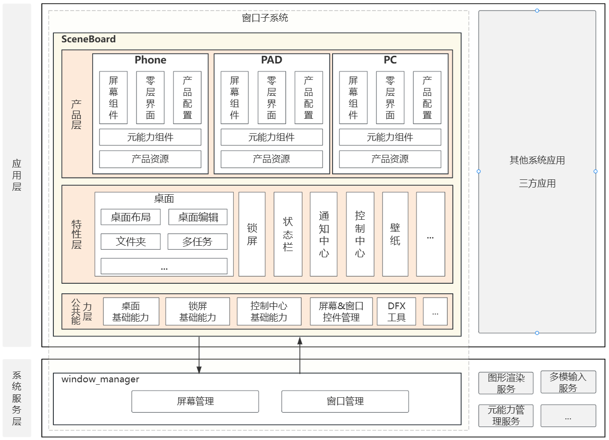

# SceneBoard

- [SceneBoard](#SceneBoard)
  - [简介](#简介)
  - [架构说明](#架构说明)
  - [编译构建](#编译构建)
  - [开发](#开发)
  - [目录](#目录)
  - [约束](#约束)
  - [参与贡献](#参与贡献)
  - [相关仓](#相关仓)

## 简介
**SceneBoard** 是 OpenHarmony 窗口管理子系统的部件之一。作为系统级应用，承载系统与用户交互的入口、以及系统UI的实现（例如：系统桌面、壁纸、锁屏等），支持 phone、pad、pc 等多种设备形态，提供全场景桌面体验。



### 核心能力
**系统交互入口**
- 使用 `ServiceExtensionAbility` 作为主入口，系统启动时启动。
- 负责初始化和编排合一桌面 UI 的显示和层级关系，为用户提供桌面交互体验。
- 负责初始化屏幕和窗口控件管理模块，实现加载屏幕控件和窗口控件。

**合一桌面 UI 管理**
- 使用系统窗口加载合一桌面 UI 界面，例如：壁纸、桌面、状态栏、锁屏、通知、Dock 等。

**屏幕和窗口控件管理**
- 在 ArkUI 框架中，窗口子系统创建了屏幕控件和窗口控件，实现了应用 UI 框架的布局能力在屏幕和窗口管理上的复用。
- 通过窗口控件，管理应用主窗口、辅助窗口、系统窗口及其容器关系，管理窗口层级、焦点，以及布局、拖拽、旋转、动画等。
- 通过屏幕控件，管理主屏、扩展屏、虚拟屏等屏幕实例及其生命周期，感知屏幕尺寸、旋转等属性变化，并同步管理屏幕中的窗口。

### SceneBoard 与窗口管理服务的关系
SceneBoard 依赖窗口管理服务。

**进程维度上** ：
1. SceneBoard 与窗口管理服务运行同一个进程中。
2. SceneBoard 主入口是一个 `ServiceExtensionAbility`，在系统启动时启动并常驻，启动后会先初始化窗口管理服务，再初始化屏幕和窗口控件、加载合一桌面UI。

**职责和调用关系上**：
1. SceneBoard 负责窗口和屏幕的显示、布局和层级等交互业务。窗口管理服务负责窗口和屏幕的实例以及生命周期等数据业务。
2. 窗口管理服务负责与应用进程、以及与其他子系统（元能力子系统、图形渲染、多模输入等）的交互。
3. SceneBoard 不直接与应用进程、以及其他子系统交互，需要借助窗口管理服务提供内部接口实现间接交互。例如：应用窗口的创建过程：
	- 由应用进程通过窗口子系统提供的 SDK 接口，先与窗口管理服务交互；
	- 窗口管理服务响应接口调用，完成窗口实例的创建和状态管理；
	- 再由窗口管理服务通过内部接口通知 SceneBoard，由 SceneBoard 完成窗口控件的创建、显示和布局工作。

**说明**：SceneBoard 仅在窗口子系统开启合一架构下生效。关于合一架构和配置方式，请参考说明：[合一架构](https://gitcode.com/openharmony/window_window_manager#3-%E5%88%86%E7%A6%BB%E6%9E%B6%E6%9E%84%E4%B8%8E%E5%90%88%E4%B8%80%E6%9E%B6%E6%9E%84%E8%AF%A6%E8%A7%A3)

## 架构说明

SceneBoard 采用分层和模块化的架构设计，如图：


### 分层设计
SceneBoard 整体采用分层和模块化架构设计，分为三层：
```
产品层 (product/)：产品适配相关
  ↓
特性层 (feature/)：模块化业务功能相关
  ↓
公共能力层 (staticcommon/)：通用工具、基础管理框架相关
```

层与层之间按照跨产品可复用的程度进行划分，每一层按照业务边界划分模块，例如：
1. DFX 工具（日志、Dump、内存等工具）、屏幕和窗口控件管理、锁屏基础能力等需要跨多个产品复用的模块，放置在公共能力层；
2. 基于系统窗口的合一桌面 UI（系统桌面、锁屏、壁纸等）按照业务边界拆分成不同的模块，放置在特性层；
3. 最终公共能力和不同特性又由产品层的主入口进行集成和定制，打包为可直接部署的 .app 程序。

### 模块化设计
SceneBoard 每一层都使用模块化设计，自下而上分别是：

1. 公共能力层：位于 `staticcommon` 目录，主要包含不同产品打包 SceneBoard 时，必须集成的基础能力。
    - basecommon: 提供日志、常量、工具等DFX工具，以及屏幕和窗口控件管理的基础能力。
        - baseutils: 提供常用的基础工具，例如日志、通用常量、工具方法等。
        - windowscene: 提供屏幕和窗口控件管理的基础能力框架。
    - controlcentercommon: 提供可复用的控制中心UI组件和业务管理等基础能力。
    - launchercommon: 提供可复用的系统桌面基础能力。
    - screenlockcommon: 提供可复用的锁屏基础能力。
    - systemuicommon: 提供可复用的通知、实况窗、弹窗、状态栏的UI组件和业务管理等基础能力。

| 公共能力层模块    | 路径                                        |
| ---------- | ----------------------------------------- |
| 基础工具       | staticcommon/basecommon/basicutils        |
| 控件动画       | staticcommon/basecommon/componentanimator |
| 控件拖拽       | staticcommon/basecommon/componentdrag     |
| 屏幕与窗口控件管理  | staticcommon/basecommon/windowscene       |
| 控制中心管理基础能力 | staticcommon/controlcentercommon          |
| 系统桌面管理基础能力 | staticcommon/launchercommon               |
| 锁屏管理基础能力   | staticcommon/screenlockcommon             |
| 系统UI管理基础能力 | staticcommon/systemuicommon               |

2. 特性层：位于 `feature` 目录，主要包含可跨产品复用的特性能力，不同产品打包 SceneBoard 时可选集成不同特性。
    - 合一桌面相关的特性能力有：桌面（desktop）、应用中心（appcenter）、锁屏（screenlock）等。
    - 窗口和屏幕控件管理能力：自由窗口（pcmode）、虚拟屏（commonscbscreen）等。

| 特性层模块  | 路径                             |
| ------ | ------------------------------ |
| 应用中心   | feature/appcenter              |
| 应用安装管理 | feature/appinstall             |
| 通用虚拟屏  | feature/commonscbscreen        |
| 控制中心   | feature/controlcentercomponent |
| 系统桌面   | feature/desktop                |
| 桌面文件夹  | feature/desktopfilefolder      |
| 返回手势   | feature/gestureback            |
| 导航手势   | feature/gesturenavigation      |
| 实况窗    | feature/liveview               |
| 通知     | feature/notification*          |
| 自由多窗   | feature/pcmode                 |
| 多任务    | feature/recents                |
| 锁屏     | feature/screenlock             |
| 关机     | feature/shutdownview           |
| 任务栏    | feature/smartdock              |
| 系统弹窗   | feature/systemdialog           |
| 状态栏    | feature/statusbarcomponent     |
| 主题服务   | feature/theme*                 |
| 音量管理   | feature/volume*                |
| 壁纸管理   | feature/wallpapercomponent     |

3. 产品层：位于 `product` 目录，主要包含面向不同设备的 UI，以及特有交互的适配。
    - 该层是SceneBoard 入口层，针对不同产品打包出不同的可运行的HAP包，例如：
        - `/product/phone` 目录，是 phone 平台的SceneBoard HAP包；
        - `/product/pc` 目录，是 pc 平台的SceneBoard HAP包；
    - 可在不同的HAP包中，通过其`oh-package.json5`中集成不同的特性模块、公共能力模块。
    - 主入口为继承自 `ServiceExtensionAbility` 的 `MainAbility`。可在其 `onCreate` 等生命周期中管理特性层和公共能力层封装提供的能力。

## 编译构建


三层架构在编译态时，分别：
1. 公共能力层：
    - 各模块按照业务边界和功能内聚的原则进行划分，分别编译为HAR包。
    - 原则上，该层的模块是必选模块。

| 公共能力层模块    | 路径                                        | 编译产物                    |
| ---------- | ----------------------------------------- | ----------------------- |
| 基础工具       | staticcommon/basecommon/basicutils        | basicutils.har          |
| 控件动画       | staticcommon/basecommon/componentanimator | componentanimator.har   |
| 控件拖拽       | staticcommon/basecommon/componentdrag     | componentdrag.har       |
| 屏幕与窗口控件管理  | staticcommon/basecommon/windowscene       | windowscene.har         |
| 控制中心管理基础能力 | staticcommon/controlcentercommon          | controlcentercommon.har |
| 系统桌面管理基础能力 | staticcommon/launchercommon               | launchercommon.har      |
| 锁屏管理基础能力   | staticcommon/screenlockcommon             | screenlockcommon.har    |
| 系统UI管理基础能力 | staticcommon/systemuicommon               | systemuicommon.har      |

2. 特性层：
    - 各模块按照业务边界和功能内聚的原则进行划分，分别编译为HAR包。
    - 原则上，该层的模块是可选模块。

| 特性层模块  | 路径                             | 编译产物                       |
| ------ | ------------------------------ | -------------------------- |
| 应用中心   | feature/appcenter              | appcenter.har              |
| 应用安装管理 | feature/appinstall             | appinstall.har             |
| 通用虚拟屏  | feature/commonscbscreen        | commonscbscreen.har        |
| 控制中心   | feature/controlcentercomponent | controlcentercomponent.har |
| 系统桌面   | feature/desktop                | desktop.har                |
| 桌面文件夹  | feature/desktopfilefolder      | desktopfilefolder.har      |
| 返回手势   | feature/gestureback            | gestureback.har            |
| 导航手势   | feature/gesturenavigation      | gesturenavigation.har      |
| 实况窗    | feature/liveview               | liveview.har               |
| 通知     | feature/notification*          | notification*.har          |
| 自由多窗   | feature/pcmode                 | pcmode.har                 |
| 多任务    | feature/recents                | recents.har                |
| 锁屏     | feature/screenlock             | screenlock.har             |
| 关机     | feature/shutdownview           | shutdownview.har           |
| 任务栏    | feature/smartdock              | smartdock.har              |
| 系统弹窗   | feature/systemdialog           | systemdialog.har           |
| 状态栏    | feature/statusbarcomponent     | statusbarcomponent.har     |
| 主题服务   | feature/theme*                 | theme*.har                 |
| 音量管理   | feature/volume*                | volume*.har                |
| 壁纸管理   | feature/wallpapercomponent     | wallpapercomponent.har     |

3. 产品层：
    - 该层按照不同产品进行划分，包含`ServiceExtensionAbility`作为入口，最终编译为 .hap 模块包。

### 模块间依赖和产品集成

基于这些模块，产品层、特性层均可差异化的在模块的 `oh-package.json5` 中配置。
例如 `product/phone/oh-package.json5` 中：
```
{
  "name": "sceneboard",
  "description": "",
  "version": "1.0.0",
  "dependencies": {
    // ...
    "@ohos/windowscene": "../basecommon/windowscene", // 集成窗口管理基础能力组件
    "@ohos/volumepanelcomponent": "../../feature/volume/volumepanelcomponent", // 集成音量条组件
    "@ohos/controlcentercomponent": "../../feature/controlcentercomponent", // 集成控制控制中心组件
    "@ohos/screenlockcomponent": "../../feature/screenlockcomponent", // 集成锁屏组件
    //...
  }
}
```

> **说明**：依赖关系上应该是自上而下，单向依赖。

**phone 和 pc 产品特性集成的差异举例**

| 产品    | 集成模块举例                                                                                                                                                                           | 说明                                             | 详见                             |
| ----- | -------------------------------------------------------------------------------------------------------------------------------------------------------------------------------- | ---------------------------------------------- | ------------------------------ |
| phone | // ...<br>@ohos/recents<br>@ohos/appcenter<br>@ohos/wallpapercomponent<br>@ohos/themeservice<br>@ohos/liveview<br>@ohos/gesturenavigation<br>@ohos/commonscbscreen<br>// ...<br> | phone产品支持：<br>导航手势、主题服务、壁纸、应用中心、多任务、实况窗、通用虚拟屏等 | product/phone/oh-package.json5 |
| pc    | //...<br>@ohos/pcmode<br>@ohos/pcbase<br>@ohos/smartdock<br>@ohos/appcenter<br>@ohos/wallpapercomponent<br>@ohos/liveview<br>@ohos/commonscbscreen<br>// ...                     | pc产品支持：<br>自由多窗、任务栏、应用中心、壁纸、实况窗、通用虚拟屏等         | product/pc/oh-package.json5    |

### 编译命令
SceneBoard 是系统部件，可使用下列两种方式进行编译：
1. 仅编译 `SceneBoard`
```bash
./build.sh --product-name {product_name} --build-target SceneBoard --ccache
```

2. 编译全部系统组件
```bash
./build.sh --product-name {product_name} --ccache
```

## 开发

SceneBoard 采用 ArkTS 语言开发，其中屏幕和窗口均通过控件的方式进行管理，也支持使用其他 ArkUI 能力，可开发参考：[ArkUI 开发概述](https://gitcode.com/openharmony/docs/blob/master/zh-cn/application-dev/ui/arkts-ui-development-overview.md)

### 定制 UI
以定制屏幕上的 UI 举例说明：
- `SCBScreen` 是承载产品合一桌面的顶层控件，通过在不同层级上组合合一桌面 UI 组件即可实现该产品的桌面交互体验。
- 例如，phone 产品定义的 [SCBScreen](https://gitcode.com/openharmony-sig/window_scene_board/blob/master/product/phonebase/src/main/ets/SceneBoard/scenemanager/SCBScreen.ets)，就在不同层级上分别集成了：
	- 壁纸(Wallpaper)、系统桌面(Desktop)、锁屏(ScreenLock)、状态栏(StatusBar)、输入法面板(KeyBoard)等合一桌面特性
	- 以及各类ScenePanel(分别承载应用主窗口、全局悬浮窗、画中画、悬浮球等)。
- 开发过程中，可以在特定层级中引入已有的模块的UI、或者自定义UI。

``` arkts
// phone产品的SCBScreen
@Component
export struct SCBScreen {

  build() {
    // ...
    // Wallpaper
    this.systemSceneBuilder(...)

    // Desktop
    this.systemSceneBuilder(...)
      
    // **CustomUI**
    CustomUI(...)

    // ScenePanel for app main window or sub window
    SCBScenePanel(...)

    // ScenePanel for System Float window zorder ABOVE_SCENE_PANEL
    SCBSpecificScenePanel(...)

    // ScenePanel for PictureInPicture window
    SCBPictureInPictureScenePanel(...)

    // ScenePanel for Floating ball
    SCBFloatingBallPanel(...)

    // ScreenLock
    this.systemSceneBuilder(...)

    // StatusBar
    this.systemSceneBuilder(...)

    // KeyBoard
    this.keyboardBuilder(...)
    // ...
  }
}
```

### 新增产品
适用场景：需要新增自定义产品形态，集成差异化能力。

**步骤1：新增产品HAP包及依赖**
1. 在 `product` 目录中新增产品HAP包，例如：`product/pc`

2. 修改 `oh-package.json5`，按需集成不同的特性模块和公共能力模块。
    - `@ohos/windowscene` 是SceneBoard必选的核心模块，必选。

3. 修改 `module.json5`，配置HAP包的入口、权限声明等，例如：`product/pc/src/main/module.json5`

```
{
  "module": {
    "name": "pc_sceneboard",   // 编译HAP的名称  
    "type": "entry",
    "srcEntry": "./ets/Application/AbilityStage.ets",
    "description": "$string:mainability_description",
    "mainElement": "com.ohos.sceneboard.MainAbility",
    "deviceTypes": [
      "2in1"             // 支持的设备形态，例如：default\tablet\2in1等，支持同时配置多个平台。
    ],
    "definePermissions": [] // 权限声明，按需，可选
}
```

**步骤2：新增主入口**
1. 在HAP包中，MainAbility 需要继承自 `ServiceExtensionAblity` ，并且需要初始化 `@ohos/windowscene` 模块、加载主界面 `EntryView`。
    - 例如：pc产品 `product\pc\src\main\ets\MainAbility\MainAbility.ets` 及其主界面 `product\pc\src\main\ets\pages\EntryView.ets`。

```
// MainAbility
export default class MainAbility extends ServiceExtensionAbility {
  onCreate(want: Want): void {
    // ...

    // 必选：使用@ohos/windowscene模块接口，初始化窗口管理服务。
    SCBSceneSessionManager.getInstance().init();
    // 必选：使用@ohos/windowscene模块接口，加载主界面。
    SCBSceneSessionManager.getInstance().loadContent('page/EntryView');

    // ...
  }
  //...
}
```

2. 在主界面中通过 `RootScene` 挂载 `SCBScreen` 或定制的特定屏幕。
    - `RootScene` 为 SceneBoard 全局根节点，必须位于主界面的根节点。

```
@Component
struct EntryView {
  // 必选：使用@ohos/windowscene模块接口获取SCBRootSceneSession。
  private rootSceneSession: SCBRootSceneSession = SCBSceneSessionManager.getInstance().getRootSceneSession();

  build() {
    RootScene(this.rootSceneSession.session) { // 全局根节点
      ForEach(this.screenSessionList, (item: SCBScreenSession) => {
        if (item.session.innerName === CUSTOM_SCB_SCREEN) {
          // 虚拟屏
        } else if (this.isExtendScreen(item)) {
          // 扩展屏
        } else if { xxx } {
	      // CustomXXXScreen
	      CustomScreen()
        } else {
          // 主屏
          SCBScreen({ screenSession: item })
        }
      }, (item: SCBScreenSession) => item.session.screenId.toString())
    }
  }
}
```
3. 配置Ability作为启动入口。例如：`product\phone\src\main\module.json5`
```
{
  "module": {
    "name": "phone_sceneboard", // 编译HAP的名称  
	// ...
    "extensionAbilities": [
	  {
        "skills": [
          {
            "entities": [
              "entity.system.home",
              "flag.home.intent.from.system"
            ],
            "actions": [
              "action.system.home",
              "com.ohos.action.main",
              "action.form.publish"
            ]
          }
        ],
        "visible": true,
        "name": "com.ohos.sceneboard.MainAbility",
        "icon": "$media:icon",
        "description": "$string:mainability_description",
        "label": "$string:entry_MainAbility",
        "srcEntry": "./ets/MainAbility/MainAbility.ets",  // 声明入口MainAbility路径
        "type": "service"                                 // 声明ServiceExtensionAbility
      },
    ]
   // ...
}
```

**步骤3：定制UI**
在完成步骤1和2之后，准备工作就已经完成，定制UI可参考上一节。

## 目录
```text
scene_board
├─AppScope                           # 资源、多语言与应用级配置
├─feature                            # 特性层
│  ├─appcenter                       # 应用中心
│  ├─appinstall                      # 应用安装界面
│  ├─commonscbscreen                 # 通用屏幕与窗口面板模板
│  ├─desktop                         # 系统桌面
│  ├─gestureback                     # 返回手势
│  ├─liveview                        # 实况窗
│  ├─notification                    # 通知
│  ├─pcmode                          # PC 模式、自由窗与分屏能力
│  ├─recents                         # 多任务、任务中心
│  ├─screenlock                      # 锁屏
│  ├─smartdock                       # 任务栏
│  ├─systemdialog                    # 系统弹窗
│  ├─themecomponent                  # 主题
│  └─volume                          # 音量控制 
├─product                            # 产品层
│  ├─pad                             # 平板产品模块
│  ├─pc                              # PC 产品模块
│  ├─pcbase                          # PC 产品基础能力
│  ├─phone                           # 手机产品模块
│  └─phonebase                       # 手机/平板产品基础能力
├─scripts                            # 构建与辅助脚本
├─staticcommon                       # 公共能力层
│  ├─basecommon/basicutils           # 基础设施、工具
│  ├─basecommon/windowscene          # 窗口和屏幕控件公共能力
│  ├─controlcentercommon             # 控制中心公共能力
│  ├─launchercommon                  # 系统桌面公共能力
│  ├─screenlockcommon                # 锁屏公共能力
│  └─systemuicommon                  # 系统UI公共能力
└─hvigor                             # 工程构建脚本
```

## 约束
- 语言版本：ArkTS
- 编译依赖：
    - `window_use_scene_board` 特性开关需为 `true`，即使能窗口合一架构。参考：[window_manager架构切换](https://gitcode.com/openharmony/window_window_manager#23-%E5%8F%8C%E6%9E%B6%E6%9E%84)

## 参与贡献<a name="section171384529153"></a>

欢迎广大开发者贡献代码、文档等，具体的贡献流程和方式请参见[参与贡献](https://gitcode.com/openharmony/docs/blob/master/zh-cn/contribute/%E5%8F%82%E4%B8%8E%E8%B4%A1%E7%8C%AE.md)。

## 相关仓
- [window_manager](https://gitcode.com/openharmony/window_window_manager)
- [arkui_ace_engine](https://gitcode.com/openharmony/arkui_ace_engine)
