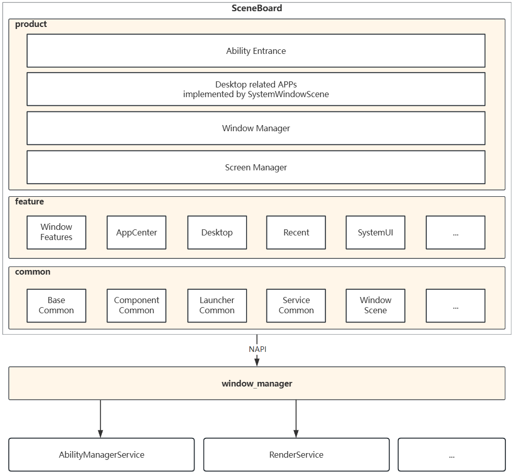

# scene_board

- [scene_board](#scene_board)
  - [简介](#简介)
  - [架构说明](#架构说明)
  - [模块划分](#模块划分)
  - [开发步骤](#开发步骤)
  - [目录](#目录)
  - [编译](#编译)
  - [约束](#约束)
  - [相关仓](#相关仓)

## 简介
**SceneBoard** 是 OpenHarmony 窗口子系统中的桌面与窗口控件管理部件，既承载桌面环境相关系统应用，也是窗口管理与屏幕管理能力在不同产品上的集成入口。

职责上，SceneBoard 面向三类对象提供能力：
1. 面向产品模块提供统一的 SceneBoard 集成入口。不同产品可以通过 `product` 层的 `ServiceExtensionAbility`、页面入口和产品基础模块完成差异化装配。
2. 面向桌面相关系统应用，提供统一的系统窗口承载容器实现集成不同的桌面特性，例如壁纸、桌面、状态栏、锁屏、应用中心、多任务等。
3. 面向窗口子系统上层逻辑提供屏幕和窗口的组织能力，基于 `ScreenSession`、`SceneSession`、`SystemSceneSession` 等会话对象管理实例、生命周期、层级与事件分发。

### 核心能力
1. 窗口管理能力
  - 管理应用主窗口、辅助窗口、系统窗口及其容器关系。
  - 维护窗口层级、焦点、旋转、动画、恢复、拖拽与布局编排。
  - 支持普通窗口模式、自由窗口模式、分屏等场景。
2. 屏幕管理能力
  - 管理主屏、扩展屏、虚拟屏等屏幕实例及其生命周期。
  - 感知屏幕尺寸、旋转、模式切换、接入断开等属性变化，并同步给窗口面板。
  - 为不同屏幕挂载对应的系统场景和窗口容器。
3. 系统窗口管理能力
  - 以系统窗口形式承载壁纸、桌面、状态栏、锁屏、通知、Dock 等系统 UI。
  - 通过统一的窗口会话管理，将系统 UI 与应用窗口统一纳入窗口控件化管理体系。
4. 产品化集成能力
  - 在 `phone`、`pc` 等产品模块中提供入口能力。

## 架构说明
SceneBoard 是一套从基础会话管理到产品集成的分层框架。它将屏幕管理、窗口管理（系统窗口和应用窗口）、以及产品化入口串联起来，最终打包为产品侧可直接部署的 hap 程序。


SceneBoard 整体采用“公共能力层 + 特性层 + 产品层”的三层架构。

1. 公共能力层
  - 提供日志、常量、工具、框架包装以及窗口会话管理基础能力。
  - 其中 `staticcommon/basecommon/windowscene` 是窗口与屏幕管理的核心公共模块，暴露 `SCBSceneSessionManager`、`SCBScreenSessionManager`、`SCBSceneSession`、`SCBScreenSession`、`SCBSystemSceneSession`、`StartAbilityUtil` 等能力。

2. 特性层
  - 以 `feature` 为主，封装跨产品复用的特性，包含桌面特性、窗口特性。

3. 产品层
  - 以 `product` 为主，当前支持 `phone`、`pc` 两种产品。
  - 将公共层和特性层装配为具体产品形态，以 `ServiceExtensionAbility` 作为入口。

协作链路：

```text
产品入口(ServiceExtensionAbility)
  -> 加载 SceneBoard 页面与上下文
  -> 初始化 SCBSceneSessionManager / SCBScreenSessionManager
  -> 构建主屏 SCBScreen 屏幕控件，按需加载扩展屏、虚拟屏
  -> 加载应用窗口面板(SCBScenePanel)、按需挂载不同的桌面相关的系统窗口控件(SCBSystemScene)
  -> 统一处理屏幕变化、窗口调度、层级管理与产品定制逻辑
```

在实现上，SceneBoard 依赖窗口子系统的会话模型进行组织：
1. `SCBScreenSession` 管理屏幕实例和属性。
2. `SCBSceneSession` 管理单个应用窗口实例和生命周期。
3. `SCBSystemSceneSession` 管理壁纸、状态栏、锁屏等系统窗口。
4. `SCBSceneSessionManager` 负责全局窗口事件、层级、容器与回调分发。
5. `SCBScreenSessionManager` 负责屏幕属性变化、屏幕旋转和面板同步。

更多关于窗口与屏幕会话关系的说明，可参考 [docs/SceneBoard中的窗口.md](./docs/SceneBoard中的窗口.md)。

## 模块划分
下表列出仓库内与 SceneBoard 直接相关的核心模块及职责。

| 模块 | 主要职责 |
| --- | --- |
| `AppScope` | 应用级资源、配置和多语言资源管理。 |
| `basecommon` | 基础公共包，对外提供通用公共能力入口。 |
| `staticcommon/basecommon/basicutils` | 日志、任务、工具类等基础能力。 |
| `staticcommon/basecommon/commonconstants` | 公共常量与系统约束定义。 |
| `staticcommon/basecommon/windowscene` | 窗口/屏幕会话、系统场景、容器、启动辅助工具等核心基础能力。 |
| `feature/commonscbscreen` | 通用异源虚拟屏管理，提供通用应用窗口面板。 |
| `feature/pcmode` | 自由窗口、布局策略、窗口动画与 PC 模式面板管理。 |
| `product/phone` | 手机产品集成入口。 |
| `product/pc` | PC 产品集成入口。 |
| `scripts` / `hvigor` | 构建、同步和工程脚本。 |

### 模块协同关系
1. `windowscene` 提供基础抽象和全局管理器，是所有上层模块的能力底座。
2. `commonscbscreen` 基于 `windowscene` 封装的通用异源虚拟屏管理框架，为产品提供即插即用的屏幕容器。
3. `pcmode` 在 `windowscene` 基础上扩展自由窗、分屏和 PC 模式特性，为产品层提供高阶窗口管理策略。
4. `phonebase` 与 `pcbase` 在通用能力之上，定义各自产品形态的 `SCBScreen`、系统窗口、层级和交互规则。
5. `phone`、`pc` 作为最终集成层，通过 `ServiceExtensionAbility` 启动 SceneBoard，接入基础屏幕实现。

## 开发步骤

### 新增产品
适用场景：需要新增自定义产品，集成差异化能力。
实现方式：
1. `product` 中新增产品 hap 模块，实现 `ServiceExtensionAbility` 入口。
2. `oh-package.json5` 中按需集成不同的 feature 模块和 common 模块。
3. 在 `ServiceExtensionAbility` ArkUI 页面中通过 `RootScene` 挂载 `SCBScreen`。

当前 `phone`、`pc` 都采用了这种入口方式。

### 定制屏幕控件 SCBScreen
适用场景：需要加入产品特有的系统窗口、层级规则、手势或动画逻辑。

实现方式：
1. 以 `product/phonebase/src/main/ets/SceneBoard/scenemanager/SCBScreen.ets` 或 `product/pcbase/src/main/ets/SceneBoard/scenemanager/SCBScreen.ets` 为基线扩展。
2. 在自定义 `SCBScreen` 中维护产品自己的 `SCBScreenProperty`、屏幕旋转处理、系统场景 Builder 和面板挂载顺序。
3. 根据产品需要注册壁纸、桌面、状态栏、Dock、通知、锁屏等系统窗口。
4. 通过设置面板 z-index、回调和 ScenePanel 列表，定义系统窗口与应用窗口的协同规则。

```
@Component
export struct SCBScreen {
  build() {
    // 0层的系统窗口按照层级顺序挂在SCBScreen屏幕空间下
    Screen(this.screenSession.session.screenId) {
      // 按需定制不同的系统窗口，实现提供UI。
      SCBWallpaper()

      // ScenePanel
      SCBScenePanel({ screenProperty: $scbScreenProperty })

      // ...
    }
  }
}
```

### 开发建议
1. 定制时优先复用已有的 `SCBSceneSessionManager`、`SCBScreenSessionManager` 和通用面板能力，避免绕开全局会话管理器单独维护窗口状态。
2. `SCBScenePanel`、`SCBSpecificScenePanel` 为应用窗口容器面板是必须要在屏幕控件中实现，否则无法响应 API 。

## 目录
```text
scene_board
├─AppScope                           # 资源、多语言与应用级配置
├─basecommon                         # 基础公共包入口
├─feature                            # 跨产品复用特性层
│  ├─commonscbscreen                 # 通用屏幕与窗口面板模板
│  └─pcmode                          # PC 模式、自由窗与分屏能力
├─product                            # 产品集成层
│  ├─pc                              # PC 产品模块
│  ├─pcbase                          # PC 产品基础能力
│  ├─phone                           # 手机产品模块
│  └─phonebase                       # 手机/平板产品基础能力
├─scripts                            # 构建与辅助脚本
├─staticcommon                       # 静态公共能力层
│  └─basecommon                      # 窗口场景相关共享库集合
└─hvigor                             # 工程构建脚本
```

## 编译
`SceneBoard` 是窗口子系统的部件之一，有以下两种方式进行编译：

1. 仅编译 `SceneBoard`

```bash
./build.sh --product-name {product_name} --build-target SceneBoard --ccache
```

2. 编译全部系统组件

```bash
./build.sh --product-name {product_name} --ccache
```

## 约束
- 语言版本：ArkTS
- 编译依赖：
  - `window_use_scene_board` 特性开关需为 `true`，即使能窗口合一架构
  - `scene_board_core`为编译时部件依赖

## 相关仓
- [window_manager](https://gitcode.com/openharmony/window_window_manager)
- [scene_board_core](https://gitcode.com/openharmony/scene_board_core)
- [arkui_ace_engine](https://gitcode.com/openharmony/arkui_ace_engine)