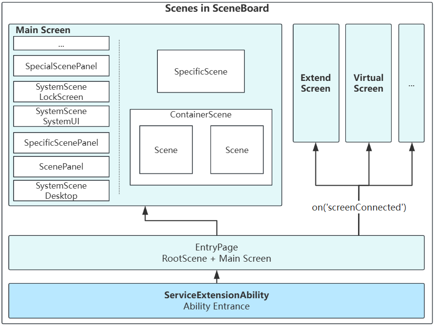

# SceneBoard中的窗口

## 介绍
在OpenHarmony窗口子系统合一架构下，窗口实现了两个基础组件用于实现屏幕管理和窗口管理，即：

- [Screen Scene](https://gitcode.com/openharmony/arkui_ace_engine/tree/master/frameworks/core/components_ng/pattern/window_scene/scene): 屏幕控件
    - ScreenSession: 即屏幕会话，用于管理屏幕实例及其生命周期。

- [Window Scene](https://gitcode.com/openharmony/arkui_ace_engine/tree/master/frameworks/core/components_ng/pattern/window_scene/screen): 窗口控件
    - SceneSession: 即窗口会话，用于管理窗口实例及其生命周期。

这两个核心组件，为 `SceneBoard` 提供了通过 `ArkUI` 控件的方式管理屏幕和窗口。因此，在 `SceneBoard` 中，使用[MVVM架构](https://gitcode.com/openharmony/docs/blob/master/en/application-dev/ui/state-management/arkts-mvvm-V2.md)来管理屏幕控件和屏幕会话、窗口控件和窗口会话。

## 会话与控件的管理

1. 屏幕会话与屏幕控件
    - 使用 `ScreenSession` 和 `Screen` 的方式，管理屏幕实例的生命周期以及数据。
    - 例如主屏幕、扩展屏、虚拟屏，均是通过一个屏幕控件和一个屏幕会话来进行管理。

2. 0层系统窗口容器
    - 使用 `SystemSceneSession` 和 `SystemScene` 的方式，管理桌面相关的应用内容以及应用窗口容器，并按照不同产品的层级规则挂载到屏幕中。
    - 桌面相关的系统应用窗口：桌面、壁纸、SystemUI、锁屏等
    - 应用窗口的顶层容器：
        - `ScenePanel`：包含锁屏下应用主窗口容器和锁屏上应用主窗口容器
        - `SpecificScenePanel`: 包含例如全局悬浮窗、Toast等特殊类型的窗口容器，它们的层级一般比主窗口更高

3. 应用窗口容器
    - 应用主窗口：通过 `SceneSession` 和 `Scene` 管理单个应用主窗口，`SceneContainer` 作为容器管理多个主窗口的组合
    - 应用辅助窗口：通过 `SpecificSceneSession` 和 `SpecificScene` 管理单个子窗、全局悬浮窗或Toast等辅助窗口

## 扩展方法
1. 产品级定制：
    - 每个产品最终会打包出一个`.hap`，入口为 `ServiceExtensionAbility`
    - 因此，可以通过在 `product` 中扩展新的 `hap` 模块实现自定义产品的 `SceneBoard`

2. 屏幕容器级定制：
    - 通过在屏幕不同层级上添加0层系统窗口容器，可以实现差异化集成桌面相关的系统应用功能。

3. 窗口容器级定制：
    - 通过 `SceneContainer` 可以实现，两个或多个应用主窗口的组合。