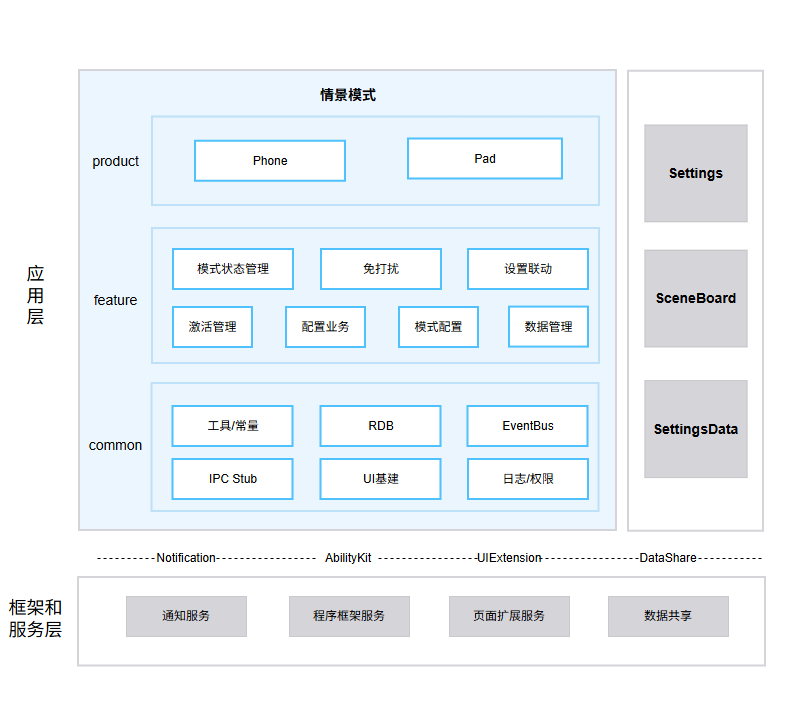

# 情景模式（IntelligentScene）

## 简介

**情景模式**（包名：`com.ohos.intelligentscene`）是 OpenHarmony 中预置的 **系统应用**。它按具体使用场景（免打扰、睡眠、学习等）分别维护一套「情景模式」：管理通知与来电策略、定时/应用等自动开启条件，以及情景模式生效后与系统设置项（如深色模式）的联动，并适配手机、平板设备形态。

本应用为系统预置应用，需通过系统参数 `const.intelligentscene.enable=true` 开启后相关能力才会生效。用户可通过「设置 → 情景模式」或控制中心二级页进入。

### 核心能力

**情景模式状态管理**
- 支持预置情景模式：免打扰、睡眠、学习等，并支持自定义情景模式。
- 通过 `StateManager` 完成情景模式的开启/关闭状态机，并把「当前已开启的情景模式」写入系统 SettingsData，供设置、控制中心等进程读取。

**免打扰**
- 管理某情景模式生效时的通知勿扰策略：允许通知的应用白名单、声音振动白名单、联系人允许/拦截、重复来电、拒接等来电策略。
- 通过 `NotDisturbAdapter` / `NotDisturbTimerManager` 把勿扰（Focus）策略下发给系统通知服务，并管理勿扰定时。

**设置联动**
- 情景模式开启后，按该模式已配置的联动项修改系统设置（例如深色模式），并处理实况通知展示。
- 通过 `SettingLinkageManager` 管理每项联动设置的状态机。

**激活管理（条件自动开启情景模式）**
- **规则**：用户在情景模式详情里配置的一组「触发条件 → 开启哪个情景模式」对应关系。条件落库后，`ActivationManager` 组装成规则集并下发给系统规则引擎（Awareness / ECA），到点或满足条件后由引擎回调自动开启对应情景模式。
- **条件触发**典型包括：
  - **时间条件**：例如每天 22:00～次日 7:00 自动开启睡眠情景模式；
  - **临时时间条件**：例如「 1 小时」临时开启免打扰；

**配置业务**
- **本机当前开启状态**（代码中的 LocalScene）：指本应用持久化的「当前哪一个情景模式处于开启、以及何时切换」等运行态数据（`CurrentOpenedMode`），供启停流程恢复与冲突处理。相关读写见 `LocalSceneManager`。
- **允许打扰配置**：某情景模式开启勿扰时，仍可正常响铃/弹通知的应用与联系人白名单；见 `AllowDisturbManager`。
- **联系人策略配置**：来电允许/拦截名单等；见 `ContactAdapter`。

**情景模式配置**
- 提供各预置情景模式的默认能力开关与设置首页「分组是否展示」等模板配置（`ModeConfigAdapter`），例如学习模式默认展示哪些设置分组。

**数据管理**
- 管理本应用的数据模型并落库，包括：
  - **情景模式实体**（名称、图标、是否可删除等，`MODE_DATA_TABLE`）；
  - **配置项**（某情景模式下的勿扰策略、联动设置、触发条件等，`MODE_CONFIG_DATA_TABLE`）；
  - **联系人策略**（`CONTACT_DATA`）等。
- 使用 **本应用自有** 的关系型数据库（OpenHarmony RDB）`IntelligentScene.db`（加密等级 S2，见 `common` 的 `DbConfig` / `RDB_STORE_CONFIG`）。跨进程共享的状态则另写系统 SettingsData。

## 架构说明

情景模式采用分层与模块化设计，按产品形态、业务特性与公共能力组织代码，如图：


### 应用层分层设计

整体划分为产品层（product）、特性层（feature）、公共层（common）：

| 层次 | 主要目录 | 职责（具象说明） |
|------|----------|------------------|
| 产品层 | `product/phone` | 手机/平板 **同一 HAP** 入口：声明 Ability / UIExtension / Service；承载设置首页、情景模式详情、控制中心二级页、免打扰相关页面等 UI；实现 IPC Stub、静态订阅者。**评测/改入口 UI 时主要改这一层。** |
| 特性层 | `feature/*` | 与「一种业务能力」一一对应的 HAR：情景模式启停、勿扰、联动、条件激活、配置读写、预置模板、RDB 业务表访问等。**改某条业务链路时主要改对应 feature。** |
| 公共层 | `common` | 多模块共用的基建，不直接表述某条用户功能：EventBus、通用列表项/弹框、本应用 RDB 封装、日志、`PermissionVerifyUtil` IPC 校验等。**跨特性复用时改这一层。** |

**产品层模块说明**（`product/phone`）

| 目录 / 组件 | 说明 |
|-------------|------|
| `entryability/` | `EntryAbility` 全屏入口；`IntelligentSceneUIExtSettingAbility` 供 **设置** 嵌入；`SceneControlUIExtAbility` 供 **控制中心** 拉起二级页等。 |
| `serviceability/` | `IntelligentSceneServiceExtAbility` 常驻服务；`DataExtAbility` 提供 DataShare URI。 |
| `pages/settinghome/` | 「设置 → 情景模式」中的列表、详情与编辑页。 |
| `pages/controlcenter/` | 控制中心情景模式二级页（快速开关列表、「更多设置」跳转等）。 |
| `pages/nodisturb/` | 允许通知应用、联系人策略、来电策略等免打扰相关页面。 |

**特性层模块说明**（`feature/*`）

| 核心能力 | 模块 | 说明 |
|--------|------|------|
| 情景模式状态管理 | StateManager（`statemanage`） | 开启/关闭指定 `modeId` 的情景模式；更新本地当前开启态；写 SettingsData（如 focus 相关键）；串联勿扰与设置联动 |
| 免打扰 | NotDisturbAdapter、NotDisturbTimerManager（`notdisturb`） | 向通知服务同步勿扰 Profile、定时勿扰 |
| 设置联动 | SettingLinkageManager（`configlinkage`） | 情景模式生效后应用深色模式等系统设置，并处理实况通知 |
| 激活管理 | ActivationManager（`activationmanage`） | 把用户配置的时间/应用等条件下发给规则引擎；维护自动开启规则与推荐规则集 |
| 配置业务 | LocalSceneManager、AllowDisturbManager、ContactAdapter（`configmanage`） | 本机当前开启态、允许打扰白名单、联系人策略的读写与生效 |
| 情景模式配置 | ModeConfigAdapter（`modeconfig`） | 预置情景模式默认能力与首页分组可见性 |
| 数据管理 | ModeDataManager、ConfigDataManager（`datamanage`） | 情景模式实体、配置项、联系人等模型及 `IntelligentScene.db` 访问 |

**公共层模块说明**（`common`）

| 目录 | 说明 |
|------|------|
| `basecomponent/` | 页面级可复用控件：`ConfirmDialogComponent` 确认弹框、单双按钮、`PromptManager` Toast、链接文案与符号图标；设置页与控制中心多处引用 |
| `constant/` | 固定取值：`ModeConstant`（情景模式 `modeId`、启停态）、`SettingsDataKeyConstant`（如 focus 等跨进程键名）、`DbConfig`（`IntelligentScene.db` 库名与 `MODE_DATA_TABLE` 等表字段）、`EventBusNameConstant`（如开启确认弹框、首页滚动事件名）、规则前缀与时间常量等 |
| `framework/` | 设置详情页基建：进程内 `EventBus`（`on`/`emit`/`detach`）在设置项开关、半模态关闭之间传状态；`PageRouter`/`PageLoader` 管理 Navigation 栈与动态页面加载；`SettingPage`/`SettingItemStandard`（标准设置行）/`SettingGroup`/`SettingSheet`（半模态子窗，含对齐全屏）/`SettingDialog`；以及 `notifyCompStateChange` 等状态模型 |
| `rdbstore/` | 本应用库访问层：`RdbStoreHelper` 打开 EL2 `IntelligentScene.db`（及备份库）执行建表、增删改查、备份恢复与损坏处理 |
| `utils/` | 日志 `LogUtil`、IPC 调用方白名单 `PermissionVerifyUtil`、SettingsData 读写 `SettingsDataUtils`、设备形态判断等 |
| `stub/` | IPC Stub 基类 `BaseServiceStub`，供 product 侧具体 Service Stub 继承并做鉴权分发 |

### 与其它应用的关系

允许系统侧应用通过 Want / UIExtension / Service 拉起本应用的已导出组件（`EntryAbility`、`IntelligentSceneUIExtSettingAbility`、`SceneControlUIExtAbility`、`IntelligentSceneServiceExtAbility` 等 `exported=true`）。**前提**：本应用已安装，且 `const.intelligentscene.enable=true`。Service / IPC 调用方须通过 `PermissionVerifyUtil` 白名单（例如 `com.ohos.sceneboard`）或受信 SA。

按场景说明：

| 场景 | 说明 |
|------|---------------------------|
| 用户进入「设置 → 情景模式」完整配置 | **设置应用**在本机安装情景模式且特性开关打开时，以 **UIExtension** 拉起 `IntelligentSceneUIExtSettingAbility`（或 Want，`uri: intelligent_scene_entry` 等）展示设置首页/详情 |
| 用户在控制中心打开情景模式面板 | **SceneBoard（控制中心宿主）**在满足同样安装/开关条件时，以 **UIExtension** 拉起 `SceneControlUIExtAbility`，展示快速开关列表；点「更多设置」再跳转设置入口 |
| 桌面/系统需要读写跨进程共享状态 | 设置、控制中心、桌面等通过系统 **SettingsData**（`@ohos.settings` / DataShare）读写本应用写入的键（如 focus 相关、当前情景模式状态）；本应用侧封装见 `SettingsDataUtils`、`SettingsDataKeyConstant` |
| 系统受信组件访问常驻能力或 DataShare | 白名单包名或受信 SA 绑定 **Service**（`IntelligentSceneServiceExtAbility`）或访问 **DataShare**（`DataExtAbility`）；未通过 `PermissionVerifyUtil` 校验的调用方会被拒绝 |

## 编译构建

本工程为多模块 HAP 应用工程，使用 Hvigor 构建，产物为 `com.ohos.intelligentscene` 系统应用包。

### 环境要求
- OpenHarmony SDK（本工程 `compileSdkVersion` 为 26.0.0，`compatibleSdkVersion` / `targetSdkVersion` 为 20）
- DevEco Studio 或命令行 Hvigor 工具链
- 系统签名证书（见 `signature/`）

### 编译命令

在工程根目录执行：

```bash
# 使用 DevEco Studio 打开工程后执行 Build，或使用 hvigor 命令行
hvigorw assembleHap
```

## 情景模式开发

情景模式采用 **ArkTS** 语言开发，UI 基于 ArkUI Stage 模型。应用通过 `product` 承载 Ability 入口与页面，通过特性层完成情景模式状态、免打扰、联动等业务，并通过 `common` 提供公共基建。开发可参考：[ArkUI 开发概述](https://gitcode.com/openharmony/docs/blob/master/zh-cn/application-dev/ui/arkts-ui-development-overview.md)

### 基于已有模块的开发

适用场景：对已有能力做功能定制，例如调整情景模式启停逻辑、扩展勿扰白名单策略、修改控制中心/设置页交互、优化联动展示等。

明确改动点：按业务边界定位到 product/phone（入口与页面）、feature/statemanage（情景模式状态管理）、feature/notdisturb（免打扰）、feature/configlinkage（设置联动）、feature/activationmanage（激活管理）、feature/configmanage（配置业务）、feature/modeconfig（情景模式配置）、feature/datamanage（数据管理）或 common（公共能力）。

以下列举一些常见的修改场景：

**场景1：修改情景模式启停链路**

- 控制中心入口位于 `product/phone/src/main/ets/pages/controlcenter/ControlCenterPage.ets`
- 状态机位于 `feature/statemanage/src/main/ets/manager/StateManager.ets`
- 勿扰策略位于 `feature/notdisturb/`

 例如，需在情景模式开启时新增自定义前置检查，可在 `StateManager.startScene()` 中添加相关逻辑：
```typescript
 // StateManager.ets — startScene 是情景模式开启流程入口
 public startScene(modeId: string, operType: number, sourceType?: number, updateTime?: number): string {
   // 【新增自定义前置检查】
   if (!this.customPreCheck(modeId)) {
     return '';
   }

   // 原有流程：状态校验 → 写入 SettingsData → 联动勿扰 / 系统设置
   // ...
 }
```
**场景2：修改设置联动链路**

- 联动管理位于 `feature/configlinkage/src/main/ets/manager/SettingLinkageManager.ets`
- 实况通知相关能力位于同模块的 LiveView 管理逻辑中

 例如，需在情景模式开启后补充一项系统设置联动，可在 `SettingLinkageManager.effectModeLinkedSettings()` 中扩展：
```typescript
 // SettingLinkageManager.ets — effectModeLinkedSettings 在情景模式生效时应用联动设置
 public async effectModeLinkedSettings(modeId: string): Promise<void> {
   LogUtil.showInfo(TAG, `effectModeLinkedSettings mode:${modeId}`);
   let darkModeState: SettingsLinkageState = await SystemSettingManager.getSystemSettingByType(modeId,
     ConfigType.SYSTEM_SETTINGS_DARK_MODE);
   this.darkModeStateMachine.convertState(darkModeState);

   let eyeProtectState: SettingsLinkageState = await SystemSettingManager.getSystemSettingByType(modeId,
     ConfigType.SYSTEM_SETTINGS_EYE_PROTECT_MODE);
   this.eyeProtectStateMachine.convertState(eyeProtectState);

   // 【新增自定义联动】例如扩展一项系统设置联动状态机转换
   // let customState: SettingsLinkageState = await SystemSettingManager.getSystemSettingByType(
   //   modeId, ConfigType.YOUR_CUSTOM_SETTING);
   // this.customStateMachine.convertState(customState);
 }
```
**场景3：修改配置 / 数据**

- 预置情景模式配置位于 `feature/modeconfig/`
- 业务配置位于 `feature/configmanage/`
- 数据访问位于 `feature/datamanage/`

 例如，若需调整预置情景模式默认可见性，可在 `ModeConfigAdapter.getGroupVisible()` 中修改：
```typescript
 // ModeConfigAdapter.ets — getGroupVisible 控制设置首页某分组是否展示
 public getGroupVisible(modeId: string, groupId: HomeGroupId): boolean {
   const modeConfig: BaseModeConfig = this.getConfigByModeId(modeId);
   if (groupId === HomeGroupId.INTELLIGENT_EXPERIENCE) {
     return false;
   }
   // 【修改点】按业务需要调整分组可见性，例如强制显示某分组
   // if (groupId === HomeGroupId.SYSTEM_FUNCTION) {
   //   return true;
   // }
   return modeConfig.supportGroupIdSet.has(groupId);
 }
```
**场景4：修改UI组件**

- 设置首页、情景模式详情位于 `product/phone/src/main/ets/pages/settinghome/`
- 控制中心二级页位于 `product/phone/src/main/ets/pages/controlcenter/`
- 免打扰相关页面位于 `product/phone/src/main/ets/pages/nodisturb/`
- 通用弹框、列表项等位于 `common/src/main/ets/`

 例如，控制中心页面组合标题栏、情景模式列表与「更多设置」：
```typescript
 // ControlCenterPage.ets — 控制中心二级页组合
 @Component
 struct ControlCenterPage {
   build() {
     Column() {
       TitleBarComponent({ /* props */ })
       ModeListComponent({ /* props */ })
       BottomButtonComponent({
         onButtonClick: () => {
           this.jumpSettings();
         },
       })
     }
   }
 }
```
常用修改入口：

| 目标 | 路径 |
|------|------|
| 设置首页 / 情景模式列表与详情 | `product/phone/src/main/ets/pages/settinghome/` |
| 控制中心二级页 | `product/phone/src/main/ets/pages/controlcenter/` |
| 免打扰 / 通知白名单 / 来电策略 UI | `product/phone/src/main/ets/pages/nodisturb/` |
| 情景模式状态管理 | `feature/statemanage/` |
| 免打扰 | `feature/notdisturb/` |
| 设置联动 | `feature/configlinkage/` |
| 激活管理 | `feature/activationmanage/` |
| 配置业务 | `feature/configmanage/` |
| 情景模式配置 | `feature/modeconfig/` |
| 数据管理 | `feature/datamanage/` |
| 调用方白名单 | `common/src/main/ets/utils/PermissionVerifyUtil.ets` |

### 新特性能力的开发

下面用 **「新增一种可被时间条件自动开启的预置情景模式」**（示意名：通勤模式）串起完整步骤，以及前后依赖关系。

> **说明**：工程采用 `product + feature + common` 结构，入口在 `product/phone`。一般新业务落在已有 feature；若新增独立产品形态 HAP，再在 `product/` 下加目录并在 `build-profile.json5` 注册。

#### 目标业务（示例）

希望用户能：在设置里看到「通勤模式」→ 配置「工作日 8:00 自动开启」→ 到点系统自动开启该情景模式（勿扰/联动等策略随该模式配置生效）。

因此需要同时具备：**业务数据与启停链路**、**暴露给设置/控制中心的入口**、**用户可操作的 UI**。三步对应这三条能力链路，顺序一般是 **先业务 → 再入口 → 后 UI**。

**步骤1：扩展业务能力（在特性层写清「这个情景模式如何工作」）**

| 要解决的问题 | 说明 |
|--------------|----------------|
| 系统要认识「通勤」这个情景模式实体 | 在 `feature/modeconfig` / `feature/datamanage` 增加预置 `modeId`、默认名称图标与默认配置模板，否则列表与 RDB 没有该模式 |
| 用户配置的时间条件要能自动开/关 | 条件仍经 `feature/configmanage` 落库后，必须调用 `ActivationManager.updateIntelligentSceneRuleSet()` 下发给规则引擎；否则只写入本机库，**不会到点触发** |
| 开启时要应用勿扰、联动 | 确认 `StateManager.startScene(通勤 modeId)` 能串联 `notdisturb`、`configlinkage`；若通勤有差异化策略，在对应 feature 扩展 |

操作顺序建议：

1. 在特性层落实体与配置（`modeconfig`、`datamanage`、`configmanage`）。
2. 激活下发与启停走 `activationmanage`、`statemanage`。
3. 若能力足够独立，也可新建 `feature/xxx` HAR，在 `build-profile.json5` 与 `product/phone/oh-package.json5` 声明依赖。
4. **业务未通前不要先做完整 UI**，否则页面只能空绑数据。

**步骤2：配置 / 确认 Ability 入口（让系统应用能「找得到」本能力）**

业务逻辑若在 HAR 内，**设置/控制中心进程仍只会拉起 product 里声明的 Ability / UIExtension**。因此要核对 `product/phone/src/main/module.json5`：

- 已有导出组件是否覆盖场景：全屏 `EntryAbility`、设置嵌入用 `IntelligentSceneUIExtSettingAbility`、控制中心用 `SceneControlUIExtAbility`、后台条件触发用的 `IntelligentSceneServiceExtAbility` 等。
- 新场景若需新的 UIExtension / Service，在此 **声明 name、type、permissions、exported**，否则外部 Want **无法拉起**。
- 权限是否足够：例如读写 SettingsData 依赖 `ACCESS_SYSTEM_SETTINGS` 等。

现有入口示意：

```json
{
  "module": {
    "name": "phone",
    "type": "entry",
    "mainElement": "EntryAbility",
    "deviceTypes": [
      "default",
      "tablet"
    ],
    "abilities": [
      {
        "name": "EntryAbility",
        "srcEntry": "./ets/entryability/EntryAbility.ets",
        "exported": true
      }
    ],
    "extensionAbilities": [
      {
        "name": "IntelligentSceneUIExtSettingAbility",
        "srcEntry": "./ets/entryability/IntelligentSceneUIExtSettingAbility.ets",
        "type": "sys/commonUI"
      },
      {
        "name": "SceneControlUIExtAbility",
        "srcEntry": "./ets/entryability/SceneControlUIExtAbility.ets",
        "type": "sys/commonUI"
      },
      {
        "name": "IntelligentSceneServiceExtAbility",
        "srcEntry": "./ets/serviceability/IntelligentSceneServiceExtAbility.ets",
        "type": "service"
      }
    ]
  }
}
```

**步骤3：定制 UI（用户看见并配置步骤1 的业务）**

在业务数据与 Ability 可达之后，再改 product 页面，把通勤模式暴露给用户，例如：

| UI | 位置 | 用途 |
|----|------|------|
| 设置首页情景模式列表增加「通勤」卡片 | `pages/settinghome/` | 进入详情、总开关 |
| 条件开启页可配置工作日 8:00 | 条件相关 sheet / `configmanage` 对接页 | 写入时间条件并触发规则下发 |
| 控制中心列表展示通勤开关 | `pages/controlcenter/` | 快速启停 |
| 若有独立勿扰白名单页 | `pages/nodisturb/` | 配置允许谁打扰 |

新增独立页面时：

1. 在 `product/phone/src/main/ets/pages/` 下新增页面文件；
2. 若需要系统路由注册，在 `resources/base/profile/main_pages.json` 中声明；
3. 由 Navigation / Want / 设置页跳转链路拉起。

**三步关系小结**：步骤1 决定「自动 8:00 开启」是否真能发生；步骤2 决定设置/控制中心能否进入本应用；步骤3 决定用户如何配置与查看。缺任一步都会出现「有页面无生效」「有逻辑进不去」「有入口无数据」等问题。

## 目录
```text
intellligentscene7.0
├─AppScope                              # 应用级配置与多语言资源
│  ├─app.json5                          # bundleName、版本号等
│  └─resources/                         # 全局字符串 / 图标等资源
├─common                                # 公共层（跨特性基建）
│  └─src/main/ets/
│     ├─basecomponent/                  # 通用 UI 组件：确认弹框、Toast、链接文案、符号图标
│     ├─constant/                       # 业务常量：ModeConstant(modeId/启停)、SettingsData键、DbConfig表字段、EventBus事件名等
│     ├─framework/                      # EventBus状态分发；PageRouter导航；SettingPage/Item/Group/Sheet/Dialog设置页控件
│     ├─rdbstore/                       # RdbStoreHelper(EL2 IntelligentScene.db)/El1RdbStoreHelper：打开建表、增删改查、备份恢复
│     ├─utils/                          # LogUtil、PermissionVerifyUtil白名单、SettingsDataUtils等
│     └─stub/                           # BaseServiceStub（IPC Stub基类，供product侧继承）
├─feature                               # 特性层
│  ├─statemanage/                       # 情景模式开启/关闭状态机、写SettingsData
│  ├─notdisturb/                        # 勿扰Profile/通知白名单、定时勿扰
│  ├─configlinkage/                     # 情景模式生效后联动深色模式等系统设置、实况通知
│  ├─activationmanage/                  # 时间/应用条件下发规则引擎、推荐规则集
│  ├─configmanage/                      # 本机当前开启态、允许打扰白名单、联系人策略
│  ├─modeconfig/                        # 预置情景模式默认能力、设置首页分组可见性
│  └─datamanage/                        # 情景模式/配置项/联系人模型，访问IntelligentScene.db
├─product                               # 产品层
│  └─phone/                             # 手机 / 平板形态 HAP
│     └─src/main/ets/
│        ├─entryability/                # UIAbility / UIExtension
│        ├─serviceability/              # Service / DataShare
│        ├─pages/                       # 设置首页、控制中心、免打扰等
│        ├─stub/                        # IPC Stub 实现
│        └─subscriber/                  # 静态订阅者
├─docs/figures/                         # 架构图
├─hvigor                                # 构建工具配置
├─signature                             # 签名证书与 profile
├─build-profile.json5                   # 工程级配置
├─build.sh
├─oh-package.json5
├─OAT.xml                               # 开源合规审计
├─LICENSE
├─README.md                             # 英文说明文档
└─README_zh.md                          # 中文说明文档
```

## 约束
- **语言版本**：ArkTS
- **运行形态**：系统预置应用（`com.ohos.intelligentscene`），依赖 SettingsData、Notification、系统设置等系统能力
- **设备类型**：`手机`、`平板`（见 `product/phone/src/main/module.json5`）
- **特性开关**：需开启 `const.intelligentscene.enable`
- **权限**：情景模式所需的主要权限如下（见 `product/phone/src/main/module.json5`）

  | 权限 | 授权方式 | 使用场景（具象） |
  |------|---------|------------------|
  | ohos.permission.ACCESS_SYSTEM_SETTINGS | 系统授权 | 写入/读取 SettingsData 中当前情景模式、focus 等相关键，使设置首页与控制中心状态一致 |
  | ohos.permission.MANAGE_SETTINGS | 系统授权 | 情景模式联动改系统设置时管理设置项（如与深色模式等联动） |
  | ohos.permission.MANAGE_SECURE_SETTINGS | 系统授权 | 读写安全级 SettingsData（`USER_SECURITY`）：开启/关闭时写入 focus 启停与当前情景模式 ID；联动深色模式等系统项；实况通知相关状态；以及 DataShare 受限访问 |
  | ohos.permission.NOTIFICATION_CONTROLLER | 系统授权 | 情景模式开启免打扰时，向通知服务设置勿扰 Profile、白名单应用列表 |
  | ohos.permission.GET_BUNDLE_INFO | 系统授权 | 展示「允许通知的应用」列表时查询指定包名的应用信息与图标 |
  | ohos.permission.GET_INSTALLED_BUNDLE_LIST | 系统授权 | 打开应用白名单页时枚举本机已安装应用供用户勾选 |
  | ohos.permission.READ_CONTACTS | 用户授权 | 配置来电勿扰策略时读取通讯录联系人 |
  | ohos.permission.RUNNING_LOCK | 系统授权 | 条件触发或定时任务执行期间持锁，避免进程被过早挂起导致启停失败 |
  | ohos.permission.START_SYSTEM_DIALOG | 系统授权 | 弹出系统级确认框（例如开启某情景模式的确认对话框 |
  | ohos.permission.START_ABILITIES_FROM_BACKGROUND | 系统授权 | 时间条件到点或规则引擎回调时，在后台拉起 Service / Ability 完成自动开启 |
  | ohos.permission.START_INVISIBLE_ABILITY | 系统授权 | 从本应用后台跳转拉起不可见设置组件完成配置跳转 |

- **对外调用**：Service / IPC 仅允许白名单内包名或受信 SA 调用
- **形态适配**：手机 / 平板布局存在差异，修改 UI 时需覆盖多形态验证

## 参与贡献

欢迎广大开发者贡献代码、文档等，具体的贡献流程和方式请参见[参与贡献](https://gitcode.com/openharmony/docs/blob/master/zh-cn/contribute/%E5%8F%82%E4%B8%8E%E8%B4%A1%E7%8C%AE.md)。

## 相关仓

- [applications_settings](https://gitcode.com/openharmony/applications_settings)（设置应用，情景模式设置入口宿主）
- [window_scene_board](https://gitcode.com/openharmony-sig/window_scene_board)（SceneBoard，控制中心宿主）
- [arkui_ace_engine](https://gitcode.com/openharmony/arkui_ace_engine)
